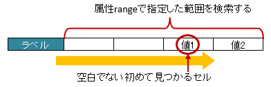
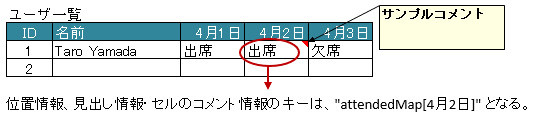

--------------------------------------
マッピング用のアノテーション
--------------------------------------

.. _annotationXlsSheet:

^^^^^^^^^^^^^^^^^^^^^^^^^^^^^^^^
``@XlsSheet``
^^^^^^^^^^^^^^^^^^^^^^^^^^^^^^^^

マッピング対象のシートを「シート番号」「シート名」「シート名」に対する正規表現のいずれかで指定します。

クラスに付与します。

.. sourcecode:: java
    
    // シート番号で指定する場合
    @XlsSheet(number=0)
    public class SampleSheet {
        ...
    }

.. sourcecode:: java
    
    // シート名で指定する場合
    @XlsSheet(name="Users")
    public class SampleSheet {
        ...
    }

~~~~~~~~~~~~~~~~~~~~~~~~~~~~~~~~~~~~~~~~~~~~~~~~~~~~
シート名を正規表現で指定する場合
~~~~~~~~~~~~~~~~~~~~~~~~~~~~~~~~~~~~~~~~~~~~~~~~~~~~

正規表現で指定する場合は、 ``XlsMapper#loadMultiple(...)`` メソッドを用いることで、同じ形式の一致した複数シートの情報を一度に取得することができます。

書き込み時は、複数のシートが一致する可能性があり、1つに特定できない場合があるため注意が必要です。

* 正規表現に一致するシートが1つしかない場合は、そのまま書き込みます。`[ver0.5+]`
* 正規表現に一致するシートが複数ある場合、アノテーション :ref:`@XlsSheetName <annotationXlsSheetName>` を付与したフィールドの値を元に決定します。
  そのため、予めフィールドに設定しておく必要があります。
* アノテーション :ref:`@XlsSheetName <annotationXlsSheetName>` を付与しているフィールドを指定し、その値に一致しなくても、正規表現に一致するシートが1つ一致すれば、そのシートに書き込まれます。`[ver0.5+]`

.. sourcecode:: java
    
    // 正規表現で指定する場合
    @XlsSheet(regex="Sheet_[0-9]+")
    public class SampleSheet {
        
        // シート名をマッピングするフィールド
        @XlsSheetName
        private String sheetName;
        ...
    }
    
    
    // 正規表現による複数のシートを出力する場合。
    // 書き込み時に、シート名を設定して、一意に関連づけます。
    SampleSheet sheet1 = new SampleSheet();
    sheet1.sheetName = "Sheet_1"; // シート名の設定
    
    SampleSheet sheet2 = new SampleSheet();
    sheet2.sheetName = "Sheet_2"; // シート名の設定
    
    SampleSheet sheet3 = new SampleSheet();
    sheet3.sheetName = "Sheet_3"; // シート名の設定
    
    // 複数のシートの書き込み
    XlsMapper xlsMapper = new XlsMapper();
    xlsMapper.saveMultiple(new FileInputStream("template.xls"),
        new FileOutputStream("out.xls"),
        new Object[]{sheet1, sheet2, sheet3}
    );

.. _annotationXlsCell:

^^^^^^^^^^^^^^^^^^^^^^^^^^^^^^^^
``@XlsCell``
^^^^^^^^^^^^^^^^^^^^^^^^^^^^^^^^

セルの列と行を指定してBeanのプロパティにマッピングします。

フィールドまたはメソッドに対して付与します。

* 属性column、rowで座標を指定します。
   
  * columnは列番号で、0から始まります。
  * rowは行番号で、0から始まります。
    
* 属性addressで、 'B3'のようにシートのアドレス形式で指定もできます。
   
  * 属性addressを指定する場合は、column, rowは指定しないでください。
  * 属性addressの両方を指定した場合、addressの値が優先されます。

.. figure:: ./_static/Cell.png
   :align: center
   
   Cell

.. sourcecode:: java
    
    @XlsSheet(name="Users")
    public class SampleSheet {
        
        // インデックス形式で指定する場合
        @XlsCell(column=0, row=0)
        private String title;
        
        // アドレス形式で指定する場合
        @XlsCell(address="B3")
        private String name;
        
    }

.. _annotationXlsLabelledCell:

^^^^^^^^^^^^^^^^^^^^^^^^^^^^^^^^
``@XlsLabelledCell``
^^^^^^^^^^^^^^^^^^^^^^^^^^^^^^^^

セルの見出し用のラベルセルを指定し、その左右もしくは下側のセルの値をマッピングします。

フィールドまたはメソッドに対して付与します。
 
* 属性labelで、見出しとなるセルの値を指定します。
* 属性typeで、見出しセルから見て値が設定されている位置を指定します。
    
  * 列挙型 ``LabelledCellType`` で、左右もしくは下側のセルを指定できます。
    
* 属性optionalで、見出しとなるセルが見つからない場合に無視するかどうかを指定しできます。

.. figure:: ./_static/LabelledCell.png
   :align: center
   
   LabelledCell

.. sourcecode:: java
    
    @XlsSheet(name="Users")
    public class SampleSheet {
    
        @XlsLabelledCell(label="ラベル1", type=LabelledCellType.Right)
        private String title;
        
        // ラベルセルが見つからなくても処理を続行する
        @XlsLabelledCell(label="ラベル2", type=LabelledCellType.Bottom, optional=true)
        private String summary;
    }

~~~~~~~~~~~~~~~~~~~~~~~~~~~~~~~~~~~~~~~~~~~~~~~~~~~~
ラベルセルから離れたセルを指定する方法（属性range）
~~~~~~~~~~~~~~~~~~~~~~~~~~~~~~~~~~~~~~~~~~~~~~~~~~~~

属性rangeを指定すると、属性typeの方向に向かって指定した **セル数分を検索** し、最初に発見した空白以外のセルの値を取得します。

   
   LabelledCell(range)

.. sourcecode:: java
    
    @XlsSheet(name="Users")
    public class SampleSheet {
        
        @XlsLabelledCell(label="ラベル", type=LabelledCellType.Right, range=3)
        private String title;
        
    }

~~~~~~~~~~~~~~~~~~~~~~~~~~~~~~~~~~~~~~~~~~~~~~~~~~~~
ラベルセルから離れたセルを指定する方法（属性skip）
~~~~~~~~~~~~~~~~~~~~~~~~~~~~~~~~~~~~~~~~~~~~~~~~~~~~

属性skipを指定すると、属性typeの方向に向かって指定した **セル数分離れた** セルの値をマッピングすることができます。

ラベルセルを結合してる場合、結合しているセル数-1分を指定することでマッピングできます。

.. figure:: ./_static/LabelledCell_skip.png
   :align: center
   
   LabelledCell(skip)

.. sourcecode:: java
    
    @XlsSheet(name="Users")
    public class SampleSheet {
    
        @XlsLabelledCell(label="ラベル", type=LabelledCellType.Right, skip=2)
        private String title;
        
    }

~~~~~~~~~~~~~~~~~~~~~~~~~~~~~~~~~~~~~~~~~~~~~~~~~~~~
ラベルセルが重複するセルを指定する方法
~~~~~~~~~~~~~~~~~~~~~~~~~~~~~~~~~~~~~~~~~~~~~~~~~~~~

同じラベルのセルが複数ある場合は、領域の見出しを属性headerLabelで指定します。
属性headerLabelで指定されたセルからlabel属性で指定されたセルを下方向に検索し、最初に見つかったセルをラベルセルとして使用します。

.. figure:: ./_static/LabelledCell_headerLabel.png
   :align: center
   
   LabelledCell(headerLabel)

.. sourcecode:: java
    
    @XlsSheet(name="Users")
    public class SampleSheet {
        
        @XlsLabelledCell(label="クラス名", type=LabelledCellType.Right, headerLabel="アクション")
        private String actionClassName;
        
        @XlsLabelledCell(label="クラス名", type=LabelledCellType.Right, headerLabel="アクションフォーム")
        private String formClassName;
        
    }

.. _annotationXlsSheetName:

^^^^^^^^^^^^^^^^^^^^^^^^^^^^^^^^
``@XlsSheetName``
^^^^^^^^^^^^^^^^^^^^^^^^^^^^^^^^

シート名をString型のプロパティにマッピングします。

.. sourcecode:: java
    
    @XlsSheet(name="Users")
    public class SampleSheet {
        
        @XlsSheetName
        private String sheetName;
    }

.. note:: 
    書き込み時で、シート名を正規表現で指定している場合は、 ``@XlsSheetName`` を付与しているフィールドで書き込むシートを決定します。
    そのため書き込む前に、シート名を指定する必要があります。

アノテーションをメソッドに付与する場合、書き込み時はgetterメソッドメソッドの付与が必要になります。
さらに、アノテーションは付与しなくてもよいですが、setterメソッドの定義が必要になります。
そのため、 ``@XlsSheetName`` を指定する際にはフィールドに付与することをお薦めします。

.. sourcecode:: java
    
    // メソッドにアノテーションを付与する場合
    // 読み込み時は、setterメソッドに付与する。
    @XlsSheet(name="Users")
    public class SheetObject {
        
        private String sheetName;
        
        // 読み込み時は、setterメソッドにアノテーションの付与が必要。
        @XlsSheetName
        public void setSheetName(String sheetName) {
            return sheetName;
        }
        
    }

.. sourcecode:: java
    
    // メソッドにアノテーションを付与する場合
    // 書き込み時は、getterメソッドに付与し、かつsetterメソッドの定義が必要。
    @XlsSheet(name="Users")
    public class SampleSheet {
        
        private String sheetName;
        
        // 書き込み時は、getterメソッドにアノテーションの付与が必要。
        @XlsSheetName
        public String getSheetName() {
            return sheetName;
        }
        
        // アノテーションの付与は必要ないが、定義が必要。
        public void setSheetName(String sheetName) {
            return sheetName;
        }
        
    }

.. _annotationXlsHorizontalRecords:

^^^^^^^^^^^^^^^^^^^^^^^^^^^^^^^^
``@XlsHorizontalRecords``
^^^^^^^^^^^^^^^^^^^^^^^^^^^^^^^^

水平方向に連続する行をCollection(List、Set)または配列にマッピングします。

標準では表には最上部に表の名称と列名を記述した行が必要になります。

.. figure:: ./_static/HorizontalRecord.png
   :align: center
   
   HorizontalRecords

シート用クラスに、アノテーション ``@XlsHorizontalRecords`` 使って定義し、属性tableLabelで表の名称を指定します。

List型または配列のフィールドに付与します。
List型などの場合、Genericsのタイプとして、マッピング先のBeanクラスを指定します。
指定しない場合は、アノテーションの属性 ``recordClass`` でクラス型を指定します。

レコード用クラスは、列の定義をアノテーション :ref:`@XlsColumn <annotationXlsColumn>` や :ref:`@XlsMapColumns <annotationXlsMapColumns>` で指定します。

.. sourcecode:: java
    
    // シート用クラス
    @XlsSheet(name="Users")
    public class SampleSheet {
        
        // 通常は、Genericsでクラス型を指定します。
        @XlsHorizontalRecords(tableLabel="ユーザ一覧")
        private List<UserRecord> records;
        
        // Generics型を使用しない場合は、属性 recordClass で指定します。
        @XlsHorizontalRecords(tableLabel="ユーザ一覧", recordClass=UserRecord.class)
        private List record2;
    }
    
    // レコード用クラス
    public class UserRecord {
    
        @XlsColumn(columnName="ID")
        private int id;
        
        @XlsColumn(columnName="名前")
        private String name;
    
    }

.. note::
    
    * ver1.0から、Collection型(List型、Set型)にも対応しています。
    * インタフェースの型を指定する場合、次の実装クラスのインスタンスが設定されます。
    
      * List型の場合、 ``java.util.ArrayList`` クラス。
      * Set型の場合、 ``java.util.LinkedHashMap`` クラス。
      * Collection型の場合、 ``java.util.ArrayList`` クラス。
    
    * 実装クラスを指定した場合、そのインスタンスが設定されます。

~~~~~~~~~~~~~~~~~~~~~~~~~~~~~~~~~~~~~~~~~~~~~~~~~~~~
表の開始位置の指定（表の名称がない場合）
~~~~~~~~~~~~~~~~~~~~~~~~~~~~~~~~~~~~~~~~~~~~~~~~~~~~

表の名称がない場合、属性headerColumn、headerColumnやheaderAddressで表の開始位置をセルのアドレスで指定します。

.. sourcecode:: java
    
    @XlsSheet(name="Users")
    public class SampleSheet {
        
        // インデックス形式で表の開始位置を指定する
        @XlsHorizontalRecords(headerColumn=0, headerRow=1)
        private List<UserRecord> records1;
        
        // アドレス形式で表の開始位置を指定する場合
        @XlsHorizontalRecords(headerAddress="A2")
        private List<UserRecord> records2;
    }

~~~~~~~~~~~~~~~~~~~~~~~~~~~~~~~~~~~~~~~~~~~~~~~~~~~~
表の名称から開始位置が離れた場所にある場合
~~~~~~~~~~~~~~~~~~~~~~~~~~~~~~~~~~~~~~~~~~~~~~~~~~~~

表の名称が定義してあるセルの直後に表がなく離れている場合、属性bottomで表の開始位置がどれだけ離れているか指定します。

.. figure:: ./_static/HorizontalRecord_bottom.png
   :align: center
   
   HorizontalRecords(bottom)

.. sourcecode:: java
    
    @XlsSheet(name="Users")
    public class SampleSheet {
        
        @XlsHorizontalRecords(tableLabel="ユーザ一覧", bottom=3)
        private List<UserRecord> records;
    
    }

~~~~~~~~~~~~~~~~~~~~~~~~~~~~~~~~~~~~~~~~~~~~~~~~~~~~~~~~~~~~~~~~~~~~~~~~~~~~~
表の見出しが縦に結合されデータレコードの開始位置が離れた場所にある場合
~~~~~~~~~~~~~~~~~~~~~~~~~~~~~~~~~~~~~~~~~~~~~~~~~~~~~~~~~~~~~~~~~~~~~~~~~~~~~

表の見出しセルが縦に結合され、データレコードの開始位置が離れている場合、属性headerBottomでデータレコードの開始位置がどれだけ離れているか指定します。 `[ver1.1]`

下記の例の場合、見出しの「テスト結果」は横に結合されているため :ref:`@XlsColumn(headerMerged=N) <annotationXlsColumnHeaderMerged>` と組み合わせて利用します。

.. figure:: ./_static/HorizontalRecord_headerBottom.png
   :align: center
   
   HorizontalRecords(headerBottom)

.. sourcecode:: java
    
    // シート用クラス
    @XlsSheet(name="Users")
    public class SampleSheet {
        
        // 見出しが縦に結合され、データのレコードの開始位置が離れている場合
        @XlsHorizontalRecords(tableLabel="クラス情報", headerBottom=2)
        private List<SampleRecord> records;
    
    }
    
    // レコード用クラス
    public class SampleRecord {
        
        @XlsColumn(columnName="No.")
        private int no;
        
        @XlsColumn(columnName="名前")
        private String name;
        
        // セル「国語」のマッピング
        @XlsColumn(columnName="テスト結果")
        private int sansu;
        
        // セル「算数」のマッピング
        // 結合されている見出しから離れている数を指定する
        @XlsColumn(columnName="テスト結果", headerMerged=1)
        private int kokugo;
        
        // セル「合計」のマッピング
        // 結合されている見出しから離れている数を指定する
        @XlsColumn(columnName="テスト結果", headerMerged=2)
        private int sum;
        
    }

~~~~~~~~~~~~~~~~~~~~~~~~~~~~~~~~~~~~~~~~~~~~~~~~~~~~
表の終端の指定（属性terminal）
~~~~~~~~~~~~~~~~~~~~~~~~~~~~~~~~~~~~~~~~~~~~~~~~~~~~

デフォルトでは行に1つもデータが存在しない場合、その表の終端となります。
行の一番左側の列の罫線によってテーブルの終端を検出する方法もあります。
この場合は ``@XlsHorizontalRecords`` の属性terminalに ``RecordTerminal.Border`` を指定してください。

.. figure:: ./_static/HorizontalRecord_terminal.png
   :align: center
   
   HorizontalRecords(terminal)

.. sourcecode:: java
    
    @XlsSheet(name="Users")
    public class SampleSheet {
        
        @XlsHorizontalRecords(tableLabel="ユーザ一覧", terminal=RecordTerminal.Border)
        private List<UserRecord> records;
    }

.. note::
    
    書き込む際にはテンプレート用の表中のセルは空と記述しているため、属性 ``terminal=RecordTermial.Empty`` を指定していると処理が終了してしまいます。
    そのため、強制的に ``terminal=RecordTerminal.Border`` に補正して処理するようにしています。`[ver0.5+]`

~~~~~~~~~~~~~~~~~~~~~~~~~~~~~~~~~~~~~~~~~~~~~~~~~~~~~~~~~~~~~~
空のレコードを読み飛ばす条件の指定
~~~~~~~~~~~~~~~~~~~~~~~~~~~~~~~~~~~~~~~~~~~~~~~~~~~~~~~~~~~~~~

skipEmptyRecord属性で、読み込み時に空のレコードを読み飛ばすことができます。

レコード用のクラスには、レコードを空と判定するためのメソッド用意し、アノテーション :ref:`@XlsIsEmpty <annotationXlsIsEmpty>` を付与します。

また、この属性は読み込み時のみに有効です。書き込み時は、空のレコードでもそのまま出力されます。

.. sourcecode:: java
    
    // ルートのオブジェクト
    @XlsSheet(name="シート名")
    public class SampleSheet {
        
        @XlsHorizontalRecords(tableLabel="ユーザ一覧", terminal=RecordTerminal.Border,
                skipEmptyRecord=true)
        private List<UserRecord> users;
    }
    
    // レコードのオブジェクト
    public class UserRecord {
        
        @XlsColumn(columnName="名前")
        private String name;
        
        // レコードが空と判定するためのメソッド
        @XlsIsEmpty
        public boolean isEmpty() {
            
            if(name != null || !name.isEmpty()) {
                return false;
            }
            
            return true;
        }
    }

~~~~~~~~~~~~~~~~~~~~~~~~~~~~~~~~~~~~~~~~~~~~~~~~~~~~
表の終端の指定（属性terminateLabel）
~~~~~~~~~~~~~~~~~~~~~~~~~~~~~~~~~~~~~~~~~~~~~~~~~~~~

表が他の表と連続しておりterminal属性でBorder、Emptyのいずれを指定しても終端を検出できない場合があります。
このような場合はterminateLabel属性で終端を示すセルの文字列を指定します。

.. figure:: ./_static/HorizontalRecord_terminateLabel.png
   :align: center
   
   HorizontalRecords(terminateLabel)

.. sourcecode:: java
    
    @XlsSheet(name="Users")
    public class SampleSheet {
        
        @XlsHorizontalRecords(tableLabel="クラス情報", terminal=RecordTerminal.Border,
                terminateLabel="平均")
        private List<UserRecord> userRecords;

    }

~~~~~~~~~~~~~~~~~~~~~~~~~~~~~~~~~~~~~~~~~~~~~~~~~~~~
表の見出しの走査の終了条件の指定(headerLimit)
~~~~~~~~~~~~~~~~~~~~~~~~~~~~~~~~~~~~~~~~~~~~~~~~~~~~

属性headerLimitを指定すると、テーブルのカラムが指定数見つかったタイミングでExcelシートの走査を終了します。
主に無駄な走査を抑制したい場合にしますが、:ref:`@XlsIterateTables <annotationXlsIterateTables>` 使用時に、テーブルが隣接しており終端を検出できない場合などに
カラム数を明示的に指定してテーブルの区切りを指定する場合にも使用できます。

たとえば以下の例は、列の見出しセルを3つ分検出したところでそのテーブルの終端と見なします。

.. figure:: ./_static/HorizontalRecord_headerLimit.png
   :align: center
   
   HorizontalRecords(headerLimit)

.. sourcecode:: java
    
    @XlsSheet(name="Users")
    public class SampleSheet {
        
        @XlsHorizontalRecords(tableLabel="クラス情報", terminal=RecordTerminal.Border,
                headerLimit=3)
        private List<UserRecord> records;
    }

なお、セルが見つからなかった場合はエラーとなりますが、optional属性にtrueを指定しておくと、無視して処理を続行します。

~~~~~~~~~~~~~~~~~~~~~~~~~~~~~~~~~~~~~~~~~~~~~~~~~~~~~~~~~~~~~~
書き込み時にレコードが不足、余分である場合の操作の指定
~~~~~~~~~~~~~~~~~~~~~~~~~~~~~~~~~~~~~~~~~~~~~~~~~~~~~~~~~~~~~~

属性overRecord、remainedRecordで、書き込み時のレコードの操作を指定することができます。
 
* 属性overRecoredで、書き込み時にデータのレコード数に対してシートのレコードが足りない場合の操作を指定します。
    
  * ``OverRecordOperate.Insert`` を指定すると行を挿入してレコードを書き込みます。その際に、上部のセルのスタイルなどをコピーします。
  * ``OverRecordOperate.Copy`` を指定すると上部のセルを下部にコピーして値を設定します。
  * ``OverRecordOperate.Break`` を指定すると、レコードの書き込みをその時点で止めます。
    
* 属性remainedRecordで、書き込み時にデータのレコード数に対してシートのレコードが余っている際の操作を指定します。
    
  * ``RemainedRecordOperate.Clear`` でセルの値をクリアします。
  * ``RemainedRecordOperate.Delete`` で行を削除します。
  * ``RemainedRecordOperate.Noneは`` 何もしません。

.. figure:: ./_static/HorizontalRecord_overRecordpng.png
   :align: center
   
   HorizontalRecords(overRecord/remainedRecord)

.. sourcecode:: java
    
    @XlsSheet(name="Users")
    public class SheetObject {
        @XlsHorizontalRecords(tableLabel="ユーザ一覧",
                overRecord=OverRecordOperate.Insert, remainedRecord=RemainedRecordOperate.Clear)
        private List<UserRecord> records;
    }

.. _annotationXlsVerticalRecords:

^^^^^^^^^^^^^^^^^^^^^^^^^^^^^^^^
``@XlsVerticalRecords``
^^^^^^^^^^^^^^^^^^^^^^^^^^^^^^^^

垂直方向に連続する列をListまたは配列にマッピングします。
要するに :ref:`@XlsHorizontalRecords <annotationXlsHorizontalRecords>` を垂直方向にしたものです。
:ref:`@XlsHorizontalRecords <annotationXlsHorizontalRecords>` と同じくList型の引数を1つだけ取るsetterメソッドに対して付与します。

ここでは、アノテーション :ref:`@XlsHorizontalRecords <annotationXlsHorizontalRecords>` と異なる部分を説明します。
詳細は、アノテーション :ref:`@XlsHorizontalRecords <annotationXlsHorizontalRecords>` の説明を参照してください。

.. figure:: ./_static/VerticalRecord.png
   :align: center
   
   VerticalRecords

.. sourcecode:: java
    
    // シート用クラス
    @XlsSheet(name="Weather")
    public class SampleSheet {
        
        @XlsVerticalRecords(tableLabel="天気情報")
        private List<WeatherRecord> records;
        
    }
    
    // レコード用クラス
    public class WeatherRecord {
        
        @XlsColumn(columnName="時間")
        private String time;
        
        @XlsColumn(columnName="降水")
        private double precipitation;
    }

~~~~~~~~~~~~~~~~~~~~~~~~~~~~~~~~~~~~~~~~~~~~~~~~~~~~~~~~~~~~~~
表の名称位置の指定
~~~~~~~~~~~~~~~~~~~~~~~~~~~~~~~~~~~~~~~~~~~~~~~~~~~~~~~~~~~~~~

実際に表を作る場合、垂直方向ですが表の名称は上方に設定することが一般的です。
そのような場合、属性 ``tableLabelAbove`` の値を ``true`` に設定すると表のタイトルが上方に位置するとして処理します。(ver1.0から使用可能)

.. figure:: ./_static/VerticalRecord_tableLabelAbove.png
   :align: center
   
   VerticalRecords（tableLabelAbove）

.. sourcecode:: java
    
    @XlsSheet(name="Users")
    public class SampleSheet {
    
        @XlsVerticalRecords(tableLabel="天気情報", tableLabelAbove=true)
        private List<WeatherRecord> records;
    }

~~~~~~~~~~~~~~~~~~~~~~~~~~~~~~~~~~~~~~~~~~~~~~~~~~~~~~~~~~~~~~
表の名称から開始位置が離れた場所にある場合
~~~~~~~~~~~~~~~~~~~~~~~~~~~~~~~~~~~~~~~~~~~~~~~~~~~~~~~~~~~~~~

表の名称が定義してあるセルの直後に表がなく離れている場合、属性 ``right`` で表の開始位置がどれだけ離れているか指定します。

アノテーション :ref:`@XlsHorizontalRecords <annotationXlsHorizontalRecords>` の属性 ``bottom`` と同じような意味になります。

さらに、属性 ``tableLabelAbove=true`` と組み合わせると、下方向にどれだけ離れているかの意味になります。

.. figure:: ./_static/VerticalRecord_right.png
   :align: center
   
   VerticalRecords（right）

.. sourcecode:: java
    
    @XlsSheet(name="Users")
    public class SampleSheet {
    
        @XlsVerticalRecords(tableLabel="天気情報", right=3)
        private List<WeatherRecord> records;
    }

~~~~~~~~~~~~~~~~~~~~~~~~~~~~~~~~~~~~~~~~~~~~~~~~~~~~~~~~~~~~~~~~~~~~~~~~~~~~~
表の見出しが横に結合されデータレコードの開始位置が離れた場所にある場合
~~~~~~~~~~~~~~~~~~~~~~~~~~~~~~~~~~~~~~~~~~~~~~~~~~~~~~~~~~~~~~~~~~~~~~~~~~~~~

表の見出しセルが横に結合され、データレコードの開始位置が離れている場合、属性headerRightでデータレコードの開始位置がどれだけ離れているか指定します。 `[ver1.1]`

下記の例の場合、見出しの「テスト結果」は横に結合されているため :ref:`@XlsColumn(headerMerged=N) <annotationXlsColumnHeaderMerged>` と組み合わせて利用します。

.. figure:: ./_static/VerticalRecord_headerRight.png
   :align: center
   
   VerticalRecords(headerRight)

.. sourcecode:: java
    
    // シート用クラス
    @XlsSheet(name="Weather")
    public class SampleSheet {
        
        // 見出しが横に結合され、データのレコードの開始位置が離れている場合
        @XlsVerticalRecords(tableLabel="天気情報", headerRight=2)
        private List<SampleRecord> records;
    
    }
    
    // レコード用クラス
    public class SampleRecord {
        
        @XlsColumn(columnName="時間")
        private String time;
        
        // セル「降水」のマッピング
        @XlsColumn(columnName="測定結果")
        private double precipitation;
        
        // セル「気温」のマッピング
        // 結合されている見出しから離れている数を指定する
        @XlsColumn(columnName="測定結果", headerMerged=1)
        private int temperature;
        
        // セル「天気」のマッピング
        // 結合されている見出しから離れている数を指定する
        @XlsColumn(columnName="測定結果", headerMerged=2)
        private String wather;
        
    }

~~~~~~~~~~~~~~~~~~~~~~~~~~~~~~~~~~~~~~~~~~~~~~~~~~~~~~~~~~~~~~
書き込み時にレコードが不足、余分である場合の操作の指定
~~~~~~~~~~~~~~~~~~~~~~~~~~~~~~~~~~~~~~~~~~~~~~~~~~~~~~~~~~~~~~

属性overRecord、remainedRecordで、書き込み時のレコードの操作を指定することができますが、 ``@XlsVerticalRecords`` 場合は **一部の設定が使用できません** 。

* ``@XlsVerticalRecords`` の場合、属性 ``overRecord`` では、列の挿入を行う ``OverRecordOperate.Insert`` は使用できません。
* ``@XlsVerticalRecords`` の場合、属性 ``remaindRecord`` では、列の削除を行う ``RemainedRecordOperate.Delete`` は使用できません。

これらの操作をサポートしていない理由は、Apache POIが、一括で列の挿入、削除をサポートしていないためです。

.. _annotationXlsColumn:

^^^^^^^^^^^^^^^^^^^^^^^^^^^^^^^^
``@XlsColumn``
^^^^^^^^^^^^^^^^^^^^^^^^^^^^^^^^

アノテーション :ref:`@XlsHorizontalRecords <annotationXlsHorizontalRecords>` または :ref:`@XlsVerticalRecords <annotationXlsVerticalRecords>` において、
指定されたレコード用クラスのプロパティをカラム名にマッピングします。

フィールドやメソッドに対して付与します。

セルが見つからない場合はエラーとなりますが、属性optionalを ``true`` とすることで無視して処理を続行します。

.. figure:: ./_static/Column.png
   :align: center
   
   Column
   

.. sourcecode:: java
    
    public class SampleRecord {
    
        @XlsColumn(columnName="ID")
        private int id;
        
        @XlsColumn(columnName="名前")}
        private String name;
        
        // 存在しない列の場合は読み飛ばす
        @XlsColumn(columnName="備考", optional=true)
        private String name;
    }

~~~~~~~~~~~~~~~~~~~~~~~~~~~~~~~~~~~~~~~~~~~~~~~~~~~~~~~~~~~~~~
データの列が結合されている場合
~~~~~~~~~~~~~~~~~~~~~~~~~~~~~~~~~~~~~~~~~~~~~~~~~~~~~~~~~~~~~~

同じ値がグループごとに結合されているカラムの場合は属性mergedを ``true`` に設定します。
こうしておくと、前の列の値が引き継がれて設定されます。

.. figure:: ./_static/Column_merged.png
   :align: center
   
   Column(merged)

.. sourcecode:: java
    
    public class SampleRecord {
        
        @XlsColumn(columnName="ID")
        private int id;
        
        // 結合されてる可能性がある列
        @XlsColumn(columnName="クラス", merged=true)
        private String className;
        
        @XlsColumn(columnName="名前")
        private String name;
        
    }

.. note::
    
    書き込みに時では、属性mergedの値が ``true`` であっても、上部または左側のセルと値が同じでも結合は基本的に行いません。
    ただし、システム設定 ``XlsMapperConfig`` の項目「mergeCellOnSave」の値をtrueにすると結合されます。
 

.. _annotationXlsColumnHeaderMerged:

~~~~~~~~~~~~~~~~~~~~~~~~~~~~~~~~~~~~~~~~~~~~~~~~~~~~~~~~~~~~~~
見出し行が結合されている場合
~~~~~~~~~~~~~~~~~~~~~~~~~~~~~~~~~~~~~~~~~~~~~~~~~~~~~~~~~~~~~~

見出し行が結合され、1つの見出しに対して複数の列が存在する場合は属性headerMergedを使用します。

属性headerMergedの値には列見出しから何セル分離れているかを指定します。

属性columnNameで指定する見出しのセル名は、結合されているセルと同じ値を指定します。

.. figure:: ./_static/Column_headerMerged.png
   :align: center
   
   Column(headerMerged)
   

.. sourcecode:: java
    
    public class SampleRecord {
        
        @XlsColumn(columnName="ID")
        private int id;
        
        @XlsColumn(columnName="名前")
        private String name;
        
        @XlsColumn(columnName="連絡先")
        private String mailAddress;
        
        // 結合されている見出しから離れている数を指定する
        @XlsColumn(columnName="連絡先", headerMerged=1)
        private String tel;
        
    }

.. _annotationXlsMapColumns:

^^^^^^^^^^^^^^^^^^^^^^^^^^^^^^^^
``@XlsMapColumns``
^^^^^^^^^^^^^^^^^^^^^^^^^^^^^^^^

~~~~~~~~~~~~~~~~~~~~~~~~~~~~~~~~~~~~~~~~~~~~~~~~~~~~~~~~~~~~~~
基本的な使い方
~~~~~~~~~~~~~~~~~~~~~~~~~~~~~~~~~~~~~~~~~~~~~~~~~~~~~~~~~~~~~~

アノテーション :ref:`@XlsHorizontalRecords <annotationXlsHorizontalRecords>` もしくは :ref:`@XlsVerticalRecords <annotationXlsVerticalRecords>` において、
指定されたレコード用クラスのカラム数が可変の場合に、それらのカラムを ``java.util.Map`` として設定します。

BeanにはMapを引数に取るフィールドまたはメソッドを用意し、このアノテーションを記述します。

属性 ``previousColumnName`` で指定された次のカラム以降、カラム名をキーとしたMapが生成され、Beanにセットされます。

.. figure:: ./_static/MapColumns.png
   :align: center
   
   MapColumns

.. sourcecode:: java
    
    public class SampleRecord {
        
        @XlsColumn(columnName="ID")
        private int id;
        
        @XlsColumn(columnName="名前")
        private String name;
        
        @XlsMapColumns(previousColumnName="名前")
        private Map<String, String> attendedMap;
    }

~~~~~~~~~~~~~~~~~~~~~~~~~~~~~~~~~~~~~~~~~~~~~~~~~~~~~~~~~~~~~~
型変換する場合
~~~~~~~~~~~~~~~~~~~~~~~~~~~~~~~~~~~~~~~~~~~~~~~~~~~~~~~~~~~~~~

アノテーション :ref:`@XlsConverter <annotationXlsConverter>` などで型変換を適用するときは、Mapの値が変換対象となります。
マップのキーは必ずString型を指定してください。

.. sourcecode:: java
    
    public class SampleRecord {
        
        @XlsColumn(columnName="ID")
        private int id;
        
        @XlsColumn(columnName="名前")
        private String name;
        
        // 型変換用のアノテーションを指定した場合、Mapの値に適用されます。
        @XlsMapColumns(previousColumnName="名前")
        @XlsBooleanConverter(loadForTrue={"出席"}, loadForFalse={"欠席"},
                saveAsTrue="出席", saveAsFalse"欠席"
                failToFalse=true)
        private Map<String, Boolean> attendedMap;
    }

~~~~~~~~~~~~~~~~~~~~~~~~~~~~~~~~~~~~~~~~~~~~~~~~~~~~~~~~~~~~~~
位置情報／見出し情報を取得する際の注意事項
~~~~~~~~~~~~~~~~~~~~~~~~~~~~~~~~~~~~~~~~~~~~~~~~~~~~~~~~~~~~~~

マッピング対象のセルのアドレスを取得する際に、フィールド ``Map<String, Point> positions`` を定義しておけば、自動的にアドレスがマッピングされます。

通常は、キーにはプロパティ名が記述（フィールドの場合はフィールド名）が入ります。

アノテーション ``@XlsMapColumns`` でマッピングしたセルのキーは、 `\<プロパティ名\>[\<セルの見出し\>]` の形式になります。

同様に、マッピング対象の見出しを取得する、フィールド ``Map<String, String> labels`` へのアクセスも、
キーは、 `\<プロパティ名\>[\<セルの見出し\>]` の形式になります。

   
   MapColumns(positions/labels)

.. sourcecode:: java
    
    public class SampleRecord {
        
        // 位置情報
        private Map<String, Point> positions;
        
        // 見出し情報
        private Map<String, String> labels;
        
        @XlsColumn(columnName="ID")
        private int id;
        
        @XlsColumn(columnName="名前")
        private String name;
        
        @XlsMapColumns(previousColumnName="名前")
        private Map<String, String> attendedMap;
    }
    
    // 位置情報・見出し情報へのアクセス
    SampleRecord record = /* レコードのインスタンスの取得 */;
    
    Point position = record.positions.get("attendedMap[4月2日]");
    
    String label = recrod.labeles.get("attendedMap[4月2日]");
    

.. _annotationXlsIterateTables:

^^^^^^^^^^^^^^^^^^^^^^^^^^^^^^^^
``@XlsIterateTables``
^^^^^^^^^^^^^^^^^^^^^^^^^^^^^^^^

同一の構造の表がシート内で繰り返し出現する場合に使用します。

~~~~~~~~~~~~~~~~~~~~~~~~~~~~~~~~~~~~~~~~~~~~~~~~~~~~~~~~~~~~~~
基本的な使い方
~~~~~~~~~~~~~~~~~~~~~~~~~~~~~~~~~~~~~~~~~~~~~~~~~~~~~~~~~~~~~~

属性tableLabelで繰り返し部分の表の名称を指定します。

また、属性bottomは、``@XlsIterateTables`` 内で :ref:`@XlsHorizontalRecords <annotationXlsHorizontalRecords>` を使用する場合に、
テーブルの開始位置が ``@XlsIterateTables`` の表の名称セルからどれだけ離れているかを指定します。

.. figure:: ./_static/IterateTables.png
   :align: center
   
   IterateTables

.. sourcecode:: java
    
    // シート用クラス
    @XlsSheet(name="シート名")
    public class SampleSheet {
    
        @XlsIterateTables(tableLabel="部門情報", bottom=2)
        private List<SampleTable> tables;
    }

繰り返し部分に対応するJavaBeanでは以下のように、アノテーション :ref:`@XlsLabelledCell <annotationXlsLabelledCell>` :ref:`@XlsHorizontalRecords <annotationXlsHorizontalRecords>` を使用することができます。

アノテーション :ref:`@XlsHorizontalRecords <annotationXlsHorizontalRecords>` を使用する場合、属性tableLabel、``@XlsIterateTables`` の属性tableLabelと同じ値を指定する必要がある点に注意してください。

.. sourcecode:: java
    
    // テーブル用クラス
    public class SampleTable {
        
        @XlsLabelledCell(label="部門名", type=LabelledCellType.Right)
        private String deptName;
        
        @XlsHorizontalRecords(tableLabel="部門情報")
        private List<SampleRecord> records;
    }

繰り返し部分に対応するJavaBeanで :ref:`@XlsHorizontalRecords <annotationXlsHorizontalRecords>` を使用した場合、通常の場合と同じく :ref:`@XlsColumn <annotationXlsColumn>` や :ref:`@XlsMapColumns <annotationXlsMapColumns>` で列とのマッピングを行います。

.. sourcecode:: java
    
    // レコード用クラス
    public class SampleRecord {
        
        @XlsColumn(columnName="ID")
        private String id;
        
        @XlsColumn(columnName="名前")
        private String name;
    }

.. _annotationXlsHint:

^^^^^^^^^^^^^^^^^^^^^^^^^^^^^^^^
``@XlsHint``
^^^^^^^^^^^^^^^^^^^^^^^^^^^^^^^^

書き込み時に、``@XlsHoriontalRecords`` を使用して行の挿入や削除を行う設定を行っている場合、
フィールドの処理順序によって、``Map<String, Point> positions`` フィールドで座標がずれる場合があります。

このようなときに、``@XlsHint`` で書き込む処理順序を指定し一定に保つことができます。

``@XlsHint`` を付与しないフィールドは、付与しているフィールドよりも後から処理が実行されます。
order属性が同じ値を設定されているときは、 フィールド名の昇順で優先度を決めて処理されます。

.. figure:: ./_static/Hint.png
   :align: center
   
   Hint

.. sourcecode:: java
    
    @XlsSheet(name="Users")
    public class SampleSheet {
        
        // セルの位置情報
        private Map<String, Point> positions;
        
        @XlsHint(order=1)
        @XlsHorizontalRecords(tableLabel="ユーザ一覧", terminal=RecordTerminal.Border,
                overRecord=OverRecordOperate.Insert, remainedRecord=RemainedRecordOperate.Delete)
        private List<UserRecord> records;
        
        @XlsHint(order=2)
        @XlsLabelledCell(label="更新日", type=LabelledCellType.Right)
        private Date updateTime;
        
    }

.. note::
    
    ソースコード上で定義した順番は、実行時には保証されないため、``@XlsHint`` で順番を指定し、処理順序を一定にすることができます。
    
    ``@XlsHint`` を付与すると、書き込み時だけでなく読み込み時にも処理順序が一定になります。

.. _annotationXlsIsEmpty:

^^^^^^^^^^^^^^^^^^^^^^^^^^^^^^^^
``@XlsIsEmpty``
^^^^^^^^^^^^^^^^^^^^^^^^^^^^^^^^

アノテーション :ref:`@XlsHorizontalRecords <annotationXlsHorizontalRecords>` 、:ref:`@XlsVerticalRecords <annotationXlsVerticalRecords>` を使用して、読み込む際に、空のレコードを読み飛ばしたい場合、
レコードが空と判定するためのメソッドに付与します。

* このアノテーションを使用する場合は、:ref:`@XlsHorizontalRecords <annotationXlsHorizontalRecords>` の属性「skipEmptyRecord=true」を設定する必要があります。
* ``@XlsIsEmpty`` を付与したメソッドは、publicかつ引数なしの戻り値がboolean形式の書式にする必要があります。
* :ref:`@XlsVerticalRecords <annotationXlsVerticalRecords>` でも同様に使用できます。

また、この機能は読み込み時のみに有効です。書き込み時は、空のレコードでもそのまま出力されます。

.. sourcecode:: java
    
    // ルートのオブジェクト
    @XlsSheet(name="シート名")
    public class UnitUser {
    
        @XlsHorizontalRecords(tableLabel="ユーザ一覧", skipEmptyRecord=true)
        private List<User> users;
        
    }
    
    // レコードのオブジェクト
    public class User {
        
        @XlsColumn(columnName="No.")
        private int no;
        
        @XlsColumn(columnName="名前")
        private String name;
        
        @XlsColumn(columnName="住所")
        private String address;
        
        // レコードが空と判定するためのメソッド
        @XlsIsEmpty
        public boolean isEmpty() {
          
          if(name != null || !name.isEmpty()) {
            return false;
          }
          
          if(address != null || !address.isEmpty()) {
            return false;
          }
          
          return true;
        }
    }

``IsEmptyBuilder`` (ver.0.5から追加)を利用することで、より簡潔に記述することも可能です。

* ``IsEmptyBuilder#reflectionIsEmpty(...)`` を利用して判定する場合、位置情報を保持するフィールド ``Map<String, Point> positions`` などは除外対象とする必要があります。
* 独自に判定する場合、``IsEmptyBuilder#append(...)`` を利用します。
* さらに、 ``IsEmptyBuilder#compare(IsEmptyComparator)`` を利用することで独自の判定をすることができます。その際に、Lambda式を利用すると簡潔に記載できます。

.. sourcecode:: java
    
    // ルートのオブジェクト
    @XlsSheet(name="シート名")
    public class UnitUser {
    
        @XlsHorizontalRecords(tableLabel="ユーザ一覧", skipEmptyRecord=true)
        private List<User> users;
        
    }
    
    // レコードのオブジェクト
    public class User {
        
        // マッピングしたセルの位置情報を保持する。
        private Map<String, Point> positions;
        
        // マッピングしたセルのラベル情報を保持する。
        private Map<String, String> labels;
        
        @XlsColumn(columnName="No.")
        private int no;
        
        @XlsColumn(columnName="名前")
        private String name;
        
        @XlsColumn(columnName="住所")
        private String address;
        
        // レコードが空と判定するためのメソッド
        @XlsIsEmpty
        public boolean isEmpty() {
            return IsEmptyBuilder.reflectionIsEmpty(this, "positions", "labels");
            
        }
        
        // 独自に判定する場合
        public boolean isEmpty2() {
            return new IsEmptyBuilder()
                .append(name)
                .compare(() -> StringUtils.isBlank(address))
                .isEmpty();
        }
    }

