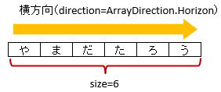

.. _annotationXlsArrayCells:

^^^^^^^^^^^^^^^^^^^^^^^^^^^^^^^^
``@XlsArrayCells``
^^^^^^^^^^^^^^^^^^^^^^^^^^^^^^^^

連続し隣接するセルをCollection(List, Set)または配列にマッピングします。  `[ver.2.0+]`

* 属性 ``column`` 、 ``row`` で、セルの位置をインデックスで指定します。
   
  * columnは列番号で、0から始まります。
  * rowは行番号で、0から始まります。
    
* 属性 ``address`` で、 'B3' のようにシートのアドレス形式で指定もできます。
   
  * 属性addressを指定する場合は、column, rowは指定しないでください。
  * 属性addressの両方を指定した場合、addressの値が優先されます。
  
* 属性 ``direction`` で、連続する隣接するセルの方向を指定します。
  
  * 列挙型 ``ArrayDirection`` で、横方向（右方向）もしくは、直方向（下方向）を指定できます。
  * 初期値は、横方向（右方向）です。
  
* 属性 ``size`` で、連続するセルの個数を指定します。
  
* Collection(List, Set)型または配列のフィールドに付与します。

  * List型などの場合、Genericsのタイプとして、マッピング先のクラスを指定します。
  * 指定しない場合は、アノテーションの属性 ``elementClass`` でクラス型を指定します。

   
   ArrayCells

.. sourcecode:: java
    :linenos:
    :caption: 基本的な使い方
    
    @XlsSheet(name="Users")
    public class SampleSheet {
        
        // インデックス形式、横方向で指定する場合
        // 属性directionを省略した場合は、ArrayDirection.Horizonを指定したと同じ意味。
        @XlsArrayCells(column=0, row=0, size=6)
        private List<String> nameKanas1;
        
        // アドレス形式、配列にマッピング
        @XlsArrayCells(address="A1", size=6, direction=ArrayDirection.Horizon)
        private String[] nameKanas2;
        
    }

~~~~~~~~~~~~~~~~~~~~~~~~~~~~~~~~~~~~~~~~~~~~~~~~~~~~~~~~~~~~~~
縦方向に隣接したセルをマッピングする場合
~~~~~~~~~~~~~~~~~~~~~~~~~~~~~~~~~~~~~~~~~~~~~~~~~~~~~~~~~~~~~~

* 縦方向にマッピングするため、属性 ``direction`` を、``ArrayDirection.Vertical`` に設定します。

.. figure:: ./_static/ArrayCells_direction.png
   :align: center
   
   ArrayCells(direction)

.. sourcecode:: java
    :linenos:
    :caption: 縦方向にマッピングする場合
    
    @XlsSheet(name="Users")
    public class SampleSheet {
        
        // 縦方向の隣接するセル
        // 属性direction=ArrayDirection.Verticalを指定すると、縦方向にマッピングします。
        @XlsLabelledArrayCells(address="B3", direction=ArrayDirection.Vertical, size=4)
        private List<String> names;
    }

~~~~~~~~~~~~~~~~~~~~~~~~~~~~~~~~~~~~~~~~~~~~~~~~~~~~~~~~~~~~~~
結合したセルをマッピングする場合
~~~~~~~~~~~~~~~~~~~~~~~~~~~~~~~~~~~~~~~~~~~~~~~~~~~~~~~~~~~~~~

* 属性 ``elementMerged`` で、セルの結合を考慮するか指定します。

  * trueのときは、結合されているセルを1つのセルとしてマッピングします。
  * falseの場合は、結合されていても解除した状態と同じマッピング結果となります。
  
    * ただし、falseのときは、書き込む際には結合が解除されます。
  
  * 初期値はtrueであるため、特に意識はする必要はありません。

* セルが結合されている場合は、結合後の個数を指定します。

.. figure:: ./_static/ArrayCells_elementMerged.png
   :align: center
   
   ArrayCells(elementMerged)

.. sourcecode:: java
    :linenos:
    :caption: 結合したセルをマッピングする場合
    
    @XlsSheet(name="Users")
    public class SampleSheet {
        
        // elementMerged=trueは初期値なので、省略可
        @XlsArrayCells(address="B3", size=3, elementMerged=true)
        private List<String> words;
        
    }

~~~~~~~~~~~~~~~~~~~~~~~~~~~~~~~~~~~~~~~~~~~~~~~~~~~~~~~~~~~~~~~~~~~~~~~~~~
書き込み時に配列・リストのサイズが不足、または余分である場合
~~~~~~~~~~~~~~~~~~~~~~~~~~~~~~~~~~~~~~~~~~~~~~~~~~~~~~~~~~~~~~~~~~~~~~~~~~

アノテーション :ref:`@XlsArrayOption <annotationXlsArrayOption>` を指定することで、書き込み時のセルの制御を指定することができます。

* 属性 ``overOperation`` で、書き込み時にJavaオブジェクトの配列・リストのサイズに対して、属性 ``size`` の値が小さく、足りない場合の操作を指定します。
* 属性 ``remainedOperation`` で、書き込み時にJavaオブジェクトの配列・リストのサイズに対して、属性 ``size`` の値が大きく、余っている場合の操作を指定します。

.. figure:: ./_static/ArrayColumns_ArrayOption.png
   :align: center
   
   ArrayCells(ArrayOption)

.. sourcecode:: java
    :linenos:
    :caption: 書き込み時の制御を行う場合
    
    @XlsSheet(name="Users")
    public class SampleSheet {
        
        @XlsArrayCells(address="B3", size=6)
        @XlsArrayOption(overOperation=OverOperation.Error, remainedOperation=RemainedOperation.Clear)
        private List<String> nameKana;
    }

