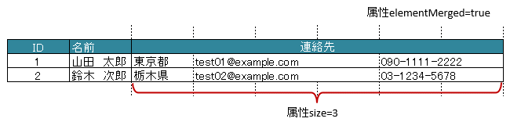
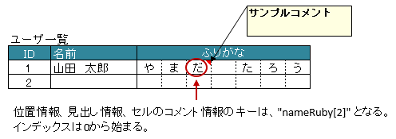

.. _annotationXlsArrayColumns:

--------------------------------
``@XlsArrayColumns``
--------------------------------

アノテーション :ref:`@XlsHorizontalRecords <annotationXlsHorizontalRecords>` もしくは :ref:`@XlsVerticalRecords <annotationXlsVerticalRecords>` において、
指隣接する連続したカラムカラムを、Collection(List, Set)または配列にマッピングします。 `[ver.2.0+]`

* 属性 ``columnName`` で、見出しとなるセルのラベルを指定します。

* 属性 ``size`` で、連続するセルの個数を指定します。

  * 見出しとなるカラムは、結合している必要があります。
  
* 見出しとなるセルが見つからない場合はエラーとなりますが、属性 ``optional`` を ``true`` とすることで無視して処理を続行します。

* Collection(List, Set)型または配列のフィールドに付与します。

  * List型などの場合、Genericsのタイプとして、マッピング先のクラスを指定します。
  * 指定しない場合は、アノテーションの属性 ``elementClass`` でクラス型を指定します。

.. figure:: ./_static/ArrayColumns.png
   :align: center
   
   ArrayColumns

.. sourcecode:: java
    :linenos:
    
    public class SampleRecord {
        
        @XlsColumn(columnName="ID")
        private int id;
        
        @XlsColumn(columnName="名前")
        private String name;
        
        @XlsArrayColumns(columnName="ふりがな", size=10)
        private List<String> nameRuby;
    }

^^^^^^^^^^^^^^^^^^^^^^^^^^^^^^^^^^^^^
結合したセルをマッピングする場合
^^^^^^^^^^^^^^^^^^^^^^^^^^^^^^^^^^^^^

* 属性 ``elementMerged`` で、セルの結合を考慮するか指定します。

  * trueのときは、結合されているセルを1つのセルとしてマッピングします。
  * falseの場合は、結合されていても解除した状態と同じマッピング結果となります。
  
    * ただし、falseのときは、書き込む際には結合が解除されます。
  
  * 初期値はtrueであるため、特に意識はする必要はありません。

* セルが結合されている場合は、結合後の個数を指定します。

   
   ArrayColumns(elementMerged)

.. sourcecode:: java
    :linenos:
    
    public class SampleRecord {
        
        @XlsColumn(columnName="ID")
        private int id;
        
        @XlsColumn(columnName="名前")
        private String name;
        
        // elementMerged=trueは初期値なので、省略可
        @XlsArrayColumns(columnName="連絡先", size=3)
        private List<String> contactInfos;
    }

^^^^^^^^^^^^^^^^^^^^^^^^^^^^^^^^^^^^^^^^^^^^^^^^^^^^^^^^^^^^^^^^^
書き込み時に配列・リストのサイズが不足、または余分である場合
^^^^^^^^^^^^^^^^^^^^^^^^^^^^^^^^^^^^^^^^^^^^^^^^^^^^^^^^^^^^^^^^^

アノテーション :ref:`@XlsArrayOption <annotationXlsArrayOption>` を指定することで、書き込み時のセルの制御を指定することができます。

* 属性 ``overOperation`` で、書き込み時にJavaオブジェクトの配列・リストのサイズに対して、属性 ``size`` の値が小さく、足りない場合の操作を指定します。
* 属性 ``remainedOperation`` で、書き込み時にJavaオブジェクトの配列・リストのサイズに対して、属性 ``size`` の値が大きく、余っている場合の操作を指定します。

.. figure:: ./_static/ArrayColumns_ArrayOption.png
   :align: center
   
   ArrayColumns(ArrayOption)

.. sourcecode:: java
    :linenos:
    
    public class SampleRecord {
        
        @XlsColumn(columnName="ID")
        private int id;
        
        @XlsColumn(columnName="名前")
        private String name;
        
        @XlsArrayColumns(columnName="ふりがな", size=6)
        @XlsArrayOption(overOperation=OverOperation.Error, remainedOperation=RemainedOperation.Clear)
        private List<String> nameRuby;
    }

^^^^^^^^^^^^^^^^^^^^^^^^^^^^^^^^^^^^^^^^^^^^^^^^^^^^^^^^^^^^^^^
位置情報／見出し情報を取得する際の注意事項
^^^^^^^^^^^^^^^^^^^^^^^^^^^^^^^^^^^^^^^^^^^^^^^^^^^^^^^^^^^^^^^

マッピング対象のセルのアドレスを取得する際に、フィールド ``Map<String, Point> positions`` を定義しておけば、自動的にアドレスがマッピングされます。

通常は、キーにはプロパティ名が記述（フィールドの場合はフィールド名）が入ります。

アノテーション ``@XlsArrayColumns`` でマッピングしたセルのキーは、インデックス付きの ``<プロパティ名>[<インデックス>]`` 形式になります。
インデックスは、0から始まります。

同様に、マッピング対象の見出しを取得する、フィールド ``Map<String, String> labels`` へのアクセスも、キーは、 ``<プロパティ名>[<インデックス>]`` の形式になります。
ただし、見出し情報の場合は、全ての要素が同じ値になるため、従来通りの ``<プロパティ名>`` でも取得できます。

   
   ArrayColumns(positions/labels)

.. sourcecode:: java
    :linenos:
    
    public class SampleRecord {
        
        // 位置情報
        private Map<String, Point> positions;
        
        // 見出し情報
        private Map<String, String> labels;
        
        @XlsColumn(columnName="ID")
        private int id;
        
        @XlsColumn(columnName="名前")
        private String name;
        
        @XlsArrayColumns(columnName="ふりがな", size=6)
        private List<String> nameRuby;
    }
    
    // 位置情報・見出し情報へのアクセス
    SampleRecord record = /* レコードのインスタンスの取得 */;
    
    Point position = record.positions.get("nameRuby[2]");
    
    String label = recrod.labeles.get("nameRuby[2]");
    
    // 見出し情報の場合、従来通りのインデックスなしでも取得できる
    String label = recrod.labeles.get("nameRuby");
    

^^^^^^^^^^^^^^^^^^^^^^^^^^^^^^^^^^^^^^^^^^^^^^^^^^^^^^^^^^^^^^^^^
見出しを正規表現、正規化して指定する場合
^^^^^^^^^^^^^^^^^^^^^^^^^^^^^^^^^^^^^^^^^^^^^^^^^^^^^^^^^^^^^^^^^

シートの構造は同じだが、ラベルのセルが微妙に異なる場合、ラベルセルを正規表現による指定が可能です。
また、空白や改行を除去してラベルセルを比較するように設定することも可能です。 `[ver1.1+]`

* 正規表現で指定する場合、アノテーションの属性の値を ``/正規表現/`` のように、スラッシュで囲み指定します。
  
  * スラッシュで囲まない場合、通常の文字列として処理されます。
  
  * 正規表現の指定機能を有効にするには、:doc:`システム設定のプロパティ <configuration>` ``regexLabelText`` の値を trueに設定します。
  
* ラベセルの値に改行が空白が入っている場合、それらを除去し、正規化してアノテーションの属性値と比較することが可能です。
  
  * 正規化とは、空白、改行、タブを除去することを指します。
   
  * ラベルを正規化する機能を有効にするには、システム設定のプロパティ ``normalizeLabelText`` の値を trueに設定します。
  

これらの指定が可能な属性は、``columnName`` です。

.. sourcecode:: java
    :linenos:
    
    // システム設定
    XlsMapper xlsMapper = new XlsMapper();
    xlsMapper.getConfiguration()
            .setRegexLabelText(true)        // ラベルを正規表現で指定可能にする機能を有効にする。
            .setNormalizeLabelText(true);   // ラベルを正規化して比較する機能を有効にする。
    
    // レコード用クラス
    public class SampleRecord {
        
        @XlsColumn(columnName="ID")
        private int id;
        
        // 正規表現による指定
        @XlsColumn(columnName="/名前.+/")
        private String name;
        
        // 正規表現による指定
        @XlsArrayColumns(columnName="/ふりがな.+/", size=10)
        private List<String> nameRuby;
        
        
    }

