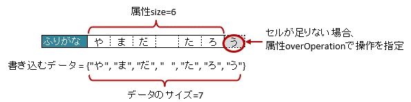

.. _annotationXlsArrayOption:

--------------------------------
``@XlsArrayOption``
--------------------------------

アノテーション :ref:`@XlsArrayCells <annotationXlsArrayCells>` 、 :ref:`@XlsLabelledArrayCells <annotationXlsLabelledArrayCells>` 、:ref:`@XlsArrayColumns <annotationXlsArrayColumns>` において、書き込み時の配列・リストの操作を指定するためのアノテーションです。 `[ver.2.0+]`

^^^^^^^^^^^^^^^^^^^^^^^^^^^^^^^^^^^^^^^^^^^^^^^^^^^^^^^^^^^^^^^^^^^^^^
書き込み時に配列・リストのサイズが不足している場合(overOperation)
^^^^^^^^^^^^^^^^^^^^^^^^^^^^^^^^^^^^^^^^^^^^^^^^^^^^^^^^^^^^^^^^^^^^^^

アノテーション ``@XlsArrayOption`` を指定することで、書き込み時のセルの制御を指定することができます。

* 属性 ``overOperation`` で、書き込み時にJavaオブジェクトの配列・リストのサイズに対して、属性 ``size`` の値が小さく、足りない場合の操作を指定します。

  * デフォルト値である列挙型 ``OverOperation#Break`` の値のとき、隣接するセルへの書き込みを中断します。
  * 列挙型 ``OverOperation#Error`` の値のとき、書き込み処理をする前に、例外 ``AnnotationInvalidException`` をスローします。

   
   ArrayOption(overOperation)

.. sourcecode:: java
    :linenos:
    
    // 書き込むデータ
    String[] data = String[]{"や", "ま", "だ", "　", "た", "ろ", "う"};
    
    // マッピングの定義
    @XlsSheet(name="Users")
    public class SampleSheet {
        
        @XlsLabelledArrayCells(columnName="ふりがな", type=LabelledCellType.Right, size=6)
        @XlsArrayOption(overOperation=OverOperation.Error)
        private String[] nameRuby;
    }

^^^^^^^^^^^^^^^^^^^^^^^^^^^^^^^^^^^^^^^^^^^^^^^^^^^^^^^^^^^^^^^^^^^^^^
書き込み時に配列・リストのサイズが余っている場合(remainedOperation)
^^^^^^^^^^^^^^^^^^^^^^^^^^^^^^^^^^^^^^^^^^^^^^^^^^^^^^^^^^^^^^^^^^^^^^

アノテーション ``@XlsArrayOption`` を指定することで、書き込み時のセルの制御を指定することができます。

* 属性 ``remainedOperation`` で、書き込み時にJavaオブジェクトの配列・リストのサイズに対して、属性 ``size`` の値が大きく、余っている場合の操作を指定します。

  * デフォルト値である列挙型 ``RemainedOperation#None`` の値のとき、隣接するセルへの書き込み、その後何もしません。
  * 列挙型 ``RemainedOperation#Clear`` の値のとき、隣接するセルへの書き込み、その後、余っているセルの値をクリアします。

.. figure:: ./_static/ArrayOption_remainedOperation.png
   :align: center
   
   ArrayOption(remainedOperation)

.. sourcecode:: java
    :linenos:
    
    // 書き込むデータ
    String[] data = String[]{"あ", "べ", "　", "あ", "い"};
    
    // マッピングの定義
    @XlsSheet(name="Users")
    public class SampleSheet {
        
        @XlsLabelledArrayCells(columnName="ふりがな", type=LabelledCellType.Right, size=6)
        @XlsArrayOption(remainedOperation=RemainedOperation.Clear)
        private String[] nameRuby;
    }

