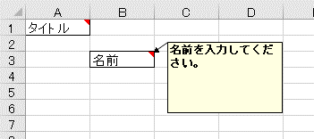

.. _annotationXlsComment:

---------------------------------
``@XlsComment``
---------------------------------

セルの列と行を指定して、セルのコメント情報をBeanのプロパティにマッピングします。 `[ver.2.1+]`

フィールドまたはメソッドに対して付与します。

書込み時のコメントの書式の制御は、アノテーション :ref:`@XlsCommentOption <annotationXlsCommentOption>` で指定します。

* 属性 ``column`` 、 ``row`` で、インデックスを指定します。
   
  * columnは列番号で、0から始まります。
  * rowは行番号で、0から始まります。
    
* 属性 ``address`` で、 'B3' のようにシートのアドレス形式で指定もできます。
   
  * 属性addressを指定する場合は、column, rowは指定しないでください。
  * 属性addressの両方を指定した場合、addressの値が優先されます。

   
   Comment

.. sourcecode:: java
    :linenos:
    
    @XlsSheet(name="Users")
    public class SampleSheet {
        
        // インデックス形式で指定する場合
        @XlsComment(column=0, row=0)
        private String titleComment;
        
        // アドレス形式で指定する場合
        @XlsComment(address="B3")
        private String titleComment;
        
    }

