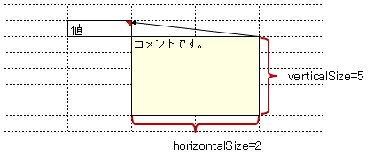

.. _annotationXlsCommentOption:

--------------------------------------
``@XlsCommentOption``
--------------------------------------

アノテーション :ref:`@XlsComment <annotationXlsComment>` 、 :ref:`@XlsLabelledComment <annotationXlsLabelledComment>`  において、書き込み時のコメントの書式などを指定するためのアノテーションです。 `[ver.2.1+]`

また、フィールド ``Map<String, String> comments`` でコメントをマッピングするセルに対しても指定可能です。

^^^^^^^^^^^^^^^^^^^^^^^^^^^^^^^^^^^^^^^^^^^^^^^^^^^^^^^^^^^^^^^^^^^^^^
書き込み時にコメントの表示／非表示設定をする。
^^^^^^^^^^^^^^^^^^^^^^^^^^^^^^^^^^^^^^^^^^^^^^^^^^^^^^^^^^^^^^^^^^^^^^

アノテーション ``@XlsCommentOption`` の属性 ``visible`` を指定することで、書き込み時にコメントの表示／非表示設定をすることができます。
  
* true場合、表示する設定になり、常にコメントが表示されます。
* 既に設定されているコメントの設定よりも、アノテーションの設定が優先されます。

   
   CommentOption(visible)

.. sourcecode:: java
    :linenos:
    
    // 書き込むデータ
    SampleSheet sheet = new SampleSheet();
    sheet.birthdayDescription = "yyyy/MM/dd の形式で設定してください。";
    sheet.setBirthdayComment("設定してください。");
    
    // マッピングの定義
    @XlsSheet(name="Users")
    public class SampleSheet {
        
        private Map<String, String> comments;
        
        @XlsCommentOption(visible=false)
        @XlsLablledComment(label="誕生日")
        private String birthdayDescription;
        
        @XlsCommentOption(visible=true)
        @XlsLabelledCell(label="誕生日", type=LabelledCellType.Right)
        private LocalDate birthday;
        
        // 誕生日の値セルのコメントの設定
        public void setBirthdayComment(String comment) {
            if(comments == null) {
                this.comments = new HashMap<>();
            }
            this.comments.put("birthday", comment);
        }
        
    }

^^^^^^^^^^^^^^^^^^^^^^^^^^^^^^^^^^^^^^^^^^^^^^^^^^^^^^^^^^^^^^^^^^^^^^^^^^^^^^^^^
書き込み時にコメントの枠サイズを指定する
^^^^^^^^^^^^^^^^^^^^^^^^^^^^^^^^^^^^^^^^^^^^^^^^^^^^^^^^^^^^^^^^^^^^^^^^^^^^^^^^^

アノテーション ``@XlsCommentOption`` の属性 ``verticalSize`` / ``horizontalSize`` を指定することで、書き込み時のコメントの枠サイズを指定することができます。

* 属性 ``verticalSize`` にて、コメント枠の縦サイズを指定します。

  * 単位は行数です。
  * 既にコメントが設定されている場合は、この設定は無視されます。

* 属性 ``horizontalSize`` にて、コメント枠の横サイズを指定します。

  * 単位は列数です。
  * 既にコメントが設定されている場合は、この設定は無視されます。

   
   CommentOption(verticalSize/horizontalSize)

.. sourcecode:: java
    :linenos:
    
    // マッピングの定義
    @XlsSheet(name="Users")
    public class SampleSheet {
        
        @XlsCommentOption(verticalSize=5, horizontalSize=2)
        @XlsCellComment(address="B2")
        private String value;
        
    }

^^^^^^^^^^^^^^^^^^^^^^^^^^^^^^^^^^^^^^^^^^^^^^^^^^^^^^^^^^^^^^^^^^^^^^^^^^^^^^^^^
書き込み時に既存のコメントを自動削除する
^^^^^^^^^^^^^^^^^^^^^^^^^^^^^^^^^^^^^^^^^^^^^^^^^^^^^^^^^^^^^^^^^^^^^^^^^^^^^^^^^

アノテーション ``@XlsCommentOption`` の属性 ``removeIfEmpty`` を指定することで、書き込むコメントの値が空のとき、既存のコメントを自動削除することができます。

属性 ``removeIfEmpty`` の初期値は ``false`` で削除されません。

.. sourcecode:: java
    :linenos:
    
    // マッピングの定義
    @XlsSheet(name="Users")
    public class SampleSheet {
        
        @XlsCommentOption(removeIfEmpty=true)
        @XlsCellComment(address="B2")
        private String value;
        
    }

^^^^^^^^^^^^^^^^^^^^^^^^^^^^^^^^^^^^^^^^^^^^^^^^^^^^^^^^^^^^^^^^^^^^^^^^^^^^^^^^^
コメントの読み込み、書き込みの処理の実装を切り替える
^^^^^^^^^^^^^^^^^^^^^^^^^^^^^^^^^^^^^^^^^^^^^^^^^^^^^^^^^^^^^^^^^^^^^^^^^^^^^^^^^

アノテーション ``@XlsCommentOption`` の属性 ``handler`` にて、コメントの処理を独自実装に切り替えることができます。

標準のコメントの処理は、 ``CellCommentHandler`` の実装クラス ``DefaultCellCommentHandler`` であるため、通常はこのクラスを継承してカスタマイズします。

全体の処理を切り替えたい場合は、:doc:`configuration` の ``CellCommentOperator`` のプロパティ ``commentHandler`` を変更します。

.. sourcecode:: java
    :linenos:
    
    @XlsSheet(name = "独自実装")
    public class CustomHandlerSheet {
        
        private Map<String, CellPosition> positions;
        
        private Map<String, String> labels;
        
        private Map<String, String> comments;
        
        @XlsSheetName
        private String sheetName;
        
        @XlsLabelledCell(label = "標準の処理", type = LabelledCellType.Right)
        private String value1;
        
        @XlsCommentOption(handler = CustomCellCommentHandler.class)
        @XlsLabelledCell(label = "独自実装の処理", type = LabelledCellType.Right)
        private String value2;
        
    }
    
    /**
     * カスタマイズしたセルのコメント処理
     */
    public class CustomCellCommentHandler extends DefaultCellCommentHandler {
        
        public CustomCellCommentHandler() {
            super();
            // 初期設定値の変更
            setMaxHorizontalSize(5);
            setMaxVerticalSize(4);
        }
        
        // 読み込み時の処理
        @Override
        public Optional<String> handleLoad(final Cell cell, Optional<XlsCommentOption> commentOption) {
            
            Optional<String> comment = super.handleLoad(cell, commentOption);
            
            // 改行を除去する。
            return comment.map(text -> text.replaceAll("\r|\n|\r\n", ""));
        }
        
        // 書き込み時の処理
        @Override
        public void handleSave(final Cell cell, final Optional<String> text, final Optional<XlsCommentOption> commentOption) {
            
            // 改行を除去する。
            text.map(comment -> comment.replaceAll("\r|\n|\r\n", ""))
                    .ifPresent(comment -> super.handleSave(cell, Optional.of(comment), commentOption));
            
        }
        
    }

^^^^^^^^^^^^^^^^^^^^^^^^^^^^^^^^^^^^^^^^^^^^^^^^^^^^^^^^^^^^^^^^^^^^^^^^^^^^^^^^^
書き込み時にコメントの枠サイズを自動設定する
^^^^^^^^^^^^^^^^^^^^^^^^^^^^^^^^^^^^^^^^^^^^^^^^^^^^^^^^^^^^^^^^^^^^^^^^^^^^^^^^^

アノテーション ``@XlsCommentOption`` の属性 ``verticalSize`` / ``horizontalSize`` でコメント枠のサイズを指定しない場合は、
書き込むコメントの文字数、改行数によって自動的に設定されます。

ただし、コメント枠のサイズは、行数、列数で指定するため、コメントが表示される領域のセルのサイズが他と異なる場合、
意図したサイズにならない場合があります。

その際は、アノテーション ``@XlsCommentOption`` を使用してサイズを直接指定します。

または、標準の自動設定値を変更します。
ここでは、標準の設定値を変更します。

標準のコメントの処理は、 ``CellCommentHandler`` の実装クラス ``DefaultCellCommentHandler`` で指定されます。
この実装は、:doc:`configuration` の ``CellCommentOperator`` のプロパティ ``commentHandler`` で保持しています。

初期値では、コメントの縦サイズは最大4行分まで、横サイズは最大3列分となります。

.. sourcecode:: java
    :linenos:
    
    // コメントを処理するハンドラのインスタンスを生成します。
    DefaultCellCommentHandler commentHandler = new DefaultCellCommentHandler();
    
    // コメントの縦サイズの最大サイズを指定します。
    commentHandler.setMaxVerticalSize(5);
    
    // コメントの横サイズの最大サイズを指定します。
    commentHandler.setMaxHorizontalSize(5);
    
    // システム設定値を変更します。
    XlsMapper xlsMapper = new XlsMapper();
    xlsMapper.getConfiguration().getCommentOperator().setCommentHandler(commentHandler);
    

