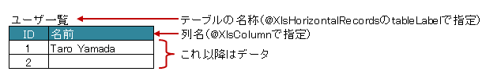
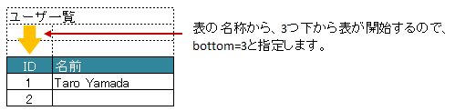

.. _annotationXlsHorizontalRecords:

---------------------------------
``@XlsHorizontalRecords``
---------------------------------

水平方向に連続する行をCollection(List、Set)または配列にマッピングします。

標準では表には最上部に表の名称と列名を記述した行が必要になります。

   
   HorizontalRecords

シート用クラスに、アノテーション ``@XlsHorizontalRecords`` 使って定義し、属性tableLabelで表の名称を指定します。

Colelction(List, Set)型または配列のフィールドに付与します。
List型などの場合、Genericsのタイプとして、マッピング先のBeanクラスを指定します。
指定しない場合は、アノテーションの属性 ``recordClass`` でクラス型を指定します。

レコード用クラスは、列の定義をアノテーション :ref:`@XlsColumn <annotationXlsColumn>` や :ref:`@XlsMapColumns <annotationXlsMapColumns>` で指定します。
また、ツリー構造のように入れ子になったレコードをマッピングする場合は、 :ref:`@XlsNestedRecords <annotationXlsNestedRecords>` を使用します。

.. sourcecode:: java
    :linenos:
    
    // シート用クラス
    @XlsSheet(name="Users")
    public class SampleSheet {
        
        // 通常は、Genericsでクラス型を指定します。
        @XlsHorizontalRecords(tableLabel="ユーザ一覧")
        private List<UserRecord> records;
        
        // Generics型を使用しない場合は、属性 recordClass で指定します。
        @XlsHorizontalRecords(tableLabel="ユーザ一覧", recordClass=UserRecord.class)
        private List record2;
    }
    
    // レコード用クラス
    public class UserRecord {
    
        @XlsColumn(columnName="ID")
        private int id;
        
        @XlsColumn(columnName="名前")
        private String name;
    
    }

.. note::
    
    * ver1.0から、Collection型(List型、Set型)にも対応しています。
    * インタフェースの型を指定する場合、次の実装クラスのインスタンスが設定されます。
    
      * List型の場合、 ``java.util.ArrayList`` クラス。
      * Set型の場合、 ``java.util.LinkedHashSet`` クラス。
      * Collection型の場合、 ``java.util.ArrayList`` クラス。
    
    * 実装クラスを指定した場合、そのインスタンスが設定されます。

^^^^^^^^^^^^^^^^^^^^^^^^^^^^^^^^^^^^^^^^^^^^^^
表の開始位置の指定（表の名称がない場合）
^^^^^^^^^^^^^^^^^^^^^^^^^^^^^^^^^^^^^^^^^^^^^^

表の名称がない場合、表の開始位置をインデックスやアドレスで指定します。

* 属性 ``headerColumn`` 、 ``headerRow`` で表の開始位置をインデックスで指定します。
  
  * headerColumnは列番号で、0から始まります。
  * headerRowは行番号で、0から始まります。

* 属性 ``headerAddress`` で、 'B3'のようにシートのアドレス形式で指定もできます。
   
  * 属性headerAddressを指定する場合は、headerColumn, headerRowは指定しないでください。
  * 属性headerAddressの両方を指定した場合、headerAddressの値が優先されます。

.. sourcecode:: java
    :linenos:
    
    @XlsSheet(name="Users")
    public class SampleSheet {
        
        // インデックス形式で表の開始位置を指定する(値は0から開始します)
        @XlsHorizontalRecords(headerColumn=0, headerRow=1)
        private List<UserRecord> records1;
        
        // アドレス形式で表の開始位置を指定する場合
        @XlsHorizontalRecords(headerAddress="A2")
        private List<UserRecord> records2;
    }

^^^^^^^^^^^^^^^^^^^^^^^^^^^^^^^^^^^^^^^^^^^^^^^^^^^^
表の名称から開始位置が離れた場所にある場合
^^^^^^^^^^^^^^^^^^^^^^^^^^^^^^^^^^^^^^^^^^^^^^^^^^^^

表の名称が定義してあるセルの直後に表がなく離れている場合、属性 ``bottom`` で表の開始位置がどれだけ離れているか指定します。

   
   HorizontalRecords(bottom)

.. sourcecode:: java
    :linenos:
    
    @XlsSheet(name="Users")
    public class SampleSheet {
        
        @XlsHorizontalRecords(tableLabel="ユーザ一覧", bottom=3)
        private List<UserRecord> records;
    
    }

^^^^^^^^^^^^^^^^^^^^^^^^^^^^^^^^^^^^^^^^^^^^^^^^^^^^^^^^^^^^^^^^^^^^^^^^^^^^^^^^^^^
表の見出しが縦に結合されデータレコードの開始位置が離れた場所にある場合
^^^^^^^^^^^^^^^^^^^^^^^^^^^^^^^^^^^^^^^^^^^^^^^^^^^^^^^^^^^^^^^^^^^^^^^^^^^^^^^^^^^

表の見出しセルが縦に結合され、データレコードの開始位置が離れている場合、属性 ``headerBottom`` でデータレコードの開始位置がどれだけ離れているか指定します。 `[ver1.1+]`

下記の例の場合、見出しの「テスト結果」は横に結合されているため :ref:`@XlsColumn(headerMerged=N) <annotationXlsColumnHeaderMerged>` と組み合わせて利用します。

.. figure:: ./_static/HorizontalRecord_headerBottom.png
   :align: center
   
   HorizontalRecords(headerBottom)

.. sourcecode:: java
    :linenos:
    
    // シート用クラス
    @XlsSheet(name="Users")
    public class SampleSheet {
        
        // 見出しが縦に結合され、データのレコードの開始位置が離れている場合
        @XlsHorizontalRecords(tableLabel="クラス情報", headerBottom=2)
        private List<SampleRecord> records;
    
    }
    
    // レコード用クラス
    public class SampleRecord {
        
        @XlsColumn(columnName="No.")
        private int no;
        
        @XlsColumn(columnName="名前")
        private String name;
        
        // セル「算数」のマッピング
        @XlsColumn(columnName="テスト結果")
        private int sansu;
        
        // セル「国語」のマッピング
        // 結合されている見出しから離れている数を指定する
        @XlsColumn(columnName="テスト結果", headerMerged=1)
        private int kokugo;
        
        // セル「合計」のマッピング
        // 結合されている見出しから離れている数を指定する
        @XlsColumn(columnName="テスト結果", headerMerged=2)
        private int sum;
        
    }

^^^^^^^^^^^^^^^^^^^^^^^^^^^^^^^^^^^^^^^^^^^^^^^^^^^^^^^^^^^^^^^^^^^^^^^^^^^^^^^^^^^
表の終端の指定（属性terminal）
^^^^^^^^^^^^^^^^^^^^^^^^^^^^^^^^^^^^^^^^^^^^^^^^^^^^^^^^^^^^^^^^^^^^^^^^^^^^^^^^^^^

デフォルトでは行に1つもデータが存在しない場合、その表の終端となります。
行の一番左側の列の罫線によってテーブルの終端を検出する方法もあります。
この場合は ``@XlsHorizontalRecords`` の属性 ``terminal`` に ``RecordTerminal.Border`` を指定してください。

.. figure:: ./_static/HorizontalRecord_terminal.png
   :align: center
   
   HorizontalRecords(terminal)

.. sourcecode:: java
    :linenos:
    
    @XlsSheet(name="Users")
    public class SampleSheet {
        
        @XlsHorizontalRecords(tableLabel="ユーザ一覧", terminal=RecordTerminal.Border)
        private List<UserRecord> records;
    }

.. note::
    
    書き込む際にはテンプレート用の表中のセルは空と記述しているため、属性 ``terminal=RecordTermial.Empty`` を指定していると処理が終了してしまいます。
    そのため、強制的に ``terminal=RecordTerminal.Border`` に補正して処理するようにしています。`[ver0.5+]`

^^^^^^^^^^^^^^^^^^^^^^^^^^^^^^^^^^^^^^^^^^^^^^^^^^^^^^^^^^^^^^^^^^^^^^^^^^^^^^^^^^^
空のレコードを読み飛ばす条件の指定
^^^^^^^^^^^^^^^^^^^^^^^^^^^^^^^^^^^^^^^^^^^^^^^^^^^^^^^^^^^^^^^^^^^^^^^^^^^^^^^^^^^

レコード用のクラスには、レコードを宇読み飛ばすかどうか判定するためのメソッド用意し、アノテーション :ref:`@XlsIgnorable <annotationXlsIgnorable>` を付与します。

また、この属性は読み込み時のみに有効です。書き込み時は、空のレコードでもそのまま出力されます。

.. sourcecode:: java
    :linenos:
    
    // ルートのオブジェクト
    @XlsSheet(name="シート名")
    public class SampleSheet {
        
        @XlsHorizontalRecords(tableLabel="ユーザ一覧", terminal=RecordTerminal.Border)
        private List<UserRecord> users;
    }
    
    // レコードのオブジェクト
    public class UserRecord {
        
        @XlsColumn(columnName="名前")
        private String name;
        
        // レコードが空と判定するためのメソッド
        @XlsIgnorable
        public boolean isEmpty() {
            
            if(name != null || !name.isEmpty()) {
                return false;
            }
            
            return true;
        }
    }

^^^^^^^^^^^^^^^^^^^^^^^^^^^^^^^^^^^^^^^^^^^^^^^^^^^^^^^^^^^^^^^^^^^^^^^^^^^^^^^^^^^
表の終端の指定（属性terminateLabel）
^^^^^^^^^^^^^^^^^^^^^^^^^^^^^^^^^^^^^^^^^^^^^^^^^^^^^^^^^^^^^^^^^^^^^^^^^^^^^^^^^^^

表が他の表と連続しており属性terminalでBorder、Emptyのいずれを指定しても終端を検出できない場合があります。
このような場合は、属性 ``terminateLabel`` で終端を示すセルの文字列を指定します。

.. figure:: ./_static/HorizontalRecord_terminateLabel.png
   :align: center
   
   HorizontalRecords(terminateLabel)

.. sourcecode:: java
    :linenos:
    
    @XlsSheet(name="Users")
    public class SampleSheet {
        
        @XlsHorizontalRecords(tableLabel="クラス情報", terminal=RecordTerminal.Border,
                terminateLabel="平均")
        private List<UserRecord> userRecords;

    }

^^^^^^^^^^^^^^^^^^^^^^^^^^^^^^^^^^^^^^^^^^^^^^^^^^^^^^^^^^^^^^^^^^^^^^^^^^^^^^^^^^^
表の見出しの走査の終了条件の指定(headerLimit)
^^^^^^^^^^^^^^^^^^^^^^^^^^^^^^^^^^^^^^^^^^^^^^^^^^^^^^^^^^^^^^^^^^^^^^^^^^^^^^^^^^^

属性 ``headerLimit`` を指定すると、テーブルのカラムが指定数見つかったタイミングでExcelシートの走査を終了します。
主に無駄な走査を抑制したい場合に指定します。

例えば、:ref:`@XlsIterateTables <annotationXlsIterateTables>` において、
テーブルが隣接しており終端を検出できないときに、カラム数を明示的に指定してテーブルを区切りたい場合に使用します。

以下の例は、列の見出しセルを3つ分検出したところでそのテーブルの終端と見なします。

.. figure:: ./_static/HorizontalRecord_headerLimit.png
   :align: center
   
   HorizontalRecords(headerLimit)

.. sourcecode:: java
    :linenos:
    
    @XlsSheet(name="Users")
    public class SampleSheet {
        
        @XlsHorizontalRecords(tableLabel="クラス情報", terminal=RecordTerminal.Border,
                headerLimit=3)
        private List<UserRecord> records;
    }

なお、セルが見つからなかった場合はエラーとなりますが、属性 ``optional`` にtrueを指定しておくと、無視して処理を続行します。

^^^^^^^^^^^^^^^^^^^^^^^^^^^^^^^^^^^^^^^^^^^^^^^^^^^^^^^^^^^^^^^^^^^^^^^^^^^^^^^^^^^
表の見出しに空白がある場合(range)
^^^^^^^^^^^^^^^^^^^^^^^^^^^^^^^^^^^^^^^^^^^^^^^^^^^^^^^^^^^^^^^^^^^^^^^^^^^^^^^^^^^

表の走査は、まず指定したタイトルなどの表の開始位置を元に、見出し用セルを取得し、その後、データのレコードを取得します。

見出し用セルを取得する際には、右方向に向かって検索をしますが、 `通常は空白セルが見つかった時点で走査を終了` します。

空白セルの次にも見出し用セルがあるような場合、属性 ``range`` を指定することで、指定した値分の空白セルを許容し、
さらに先のセルの検索を試みます。

また、属性 ``headerAddress`` や ``tableLabel`` で指定した位置から表が開始しないような場合も、
属性 ``range`` を指定することで、さらに先のセルの検索を試みます。

.. figure:: ./_static/HorizontalRecord_range.png
   :align: center
   
   HorizontalRecords(range)

.. sourcecode:: java
    :linenos:
    
    @XlsSheet(name="Users")
    public class SampleSheet {
        
        @XlsHorizontalRecords(tableLabel="ユーザ一覧", terminal=RecordTerminal.Border,
                range=3)
        private List<UserRecord> records;
    }

^^^^^^^^^^^^^^^^^^^^^^^^^^^^^^^^^^^^^^^^^^^^^^^^^^^^^^^^^^^^^^^^^^^^^^^^^^^^^^^^^^^
書き込み時にレコードが不足、余分である場合の操作の指定
^^^^^^^^^^^^^^^^^^^^^^^^^^^^^^^^^^^^^^^^^^^^^^^^^^^^^^^^^^^^^^^^^^^^^^^^^^^^^^^^^^^

アノテーション :ref:`@XlsRecordOption <annotationXlsRecordOption>` を指定することで、書き込み時のレコードの制御を指定することができます。

* 属性 ``overOperation`` で、書き込み時にJavaオブジェクトのレコード数に対して、シートのレコード数が足りないときの操作を指定します。
* 属性 ``remainedOperation`` で、書き込み時にJavaオブジェクトのレコード数に対して、シートのレコード数が余っているときの操作を指定します。

.. figure:: ./_static/HorizontalRecord_RecordOption.png
   :align: center
   
   HorizontalRecords(RecordOption)

.. sourcecode:: java
    :linenos:
    
    @XlsSheet(name="Users")
    public class SampleSheet {
        
        @XlsHorizontalRecords(tableLabel="ユーザ一覧")
        @XlsRecordOption(overOperation=OverOperation.Insert, remainedOperation=RemainedOperation.Clear)
        private List<UserRecord> records;
        
    }

^^^^^^^^^^^^^^^^^^^^^^^^^^^^^^^^^^^^^^^^^^^^^^^^^^^^^^^^^^^^^^^^^^^^^^^^^^^^^^^^^^^
任意の位置からレコードが開始するかを指定する場合
^^^^^^^^^^^^^^^^^^^^^^^^^^^^^^^^^^^^^^^^^^^^^^^^^^^^^^^^^^^^^^^^^^^^^^^^^^^^^^^^^^^

データレコードの途中で中見出しがあり、分割されているような表の場合、アノテーション :ref:`@XlsRecordFinder <annotationXlsRecordFinder>` で、レコードの開始位置を決める処理を指定することができます。 `[ver2.0+]`

* 属性 ``value`` で、レコードの開始位置を検索する実装クラスを指定します。
* 属性 ``args`` で、レコードの開始位置を検索する実装クラスに渡す引数を指定します。

.. figure:: ./_static/HorizontalRecord_RecordFinder.png
   :align: center
   
   HorizontalRecords(RecordFinder)

.. sourcecode:: java
    :linenos:
    
    // マッピングの定義
    @XlsSheet(name="Users")
    public class SampleSheet {
        
        @XlsOrder(1)
        @XlsHorizontalRecords(tableLabel="成績一覧", bottom=2, terminal=RecordTerminal.Border, terminateLabel="/クラス.+/")
        @XlsRecordFinder(value=ClassNameRecordFinder.class, args="クラスA")
        private List<Record> classA;
        
        @XlsOrder(2)
        @XlsHorizontalRecords(tableLabel="成績一覧", bottom=2, terminal=RecordTerminal.Border, terminateLabel="/クラス.+/")
        @XlsRecordFinder(value=ClassNameRecordFinder.class, args="クラスB")
        private List<Record> classB;
        
    }
    
    // クラス用の見出しのレコードを探すクラス
    public class ClassNameRecordFinder implements RecordFinder {
    
        @Override
        public CellPosition find(ProcessCase processCase, String[] args, Sheet sheet,
                CellPosition initAddress, Object beanObj, Configuration config) {
            
            // 実装は省略
        }
        
    }

^^^^^^^^^^^^^^^^^^^^^^^^^^^^^^^^^^^^^^^^^^^^^^^^^^^^^^^^^^^^^^^^^^^^^^^^^^^^^^^^^^^
表の名称を正規表現、正規化して指定する場合
^^^^^^^^^^^^^^^^^^^^^^^^^^^^^^^^^^^^^^^^^^^^^^^^^^^^^^^^^^^^^^^^^^^^^^^^^^^^^^^^^^^

シートの構造は同じだが、ラベルのセルが微妙に異なる場合、ラベルセルを正規表現による指定が可能です。
また、空白や改行を除去してラベルセルを比較するように設定することも可能です。 `[ver1.1+]`

* 正規表現で指定する場合、アノテーションの属性の値を ``/正規表現/`` のように、スラッシュで囲み指定します。
  
  * スラッシュで囲まない場合、通常の文字列として処理されます。
  
  * 正規表現の指定機能を有効にするには、:doc:`システム設定のプロパティ <configuration>` ``regexLabelText`` の値を trueに設定します。
  
* ラベセルの値に改行が空白が入っている場合、それらを除去し正規化してアノテーションの属性値と比較することが可能です。
  
  * 正規化とは、空白、改行、タブを除去することを指します。
   
  * ラベルを正規化する機能を有効にするには、:doc:`システム設定のプロパティ <configuration>` ``normalizeLabelText`` の値を trueに設定します。
  

これらの指定が可能な属性は、``tableLabel`` , ``terminateLabel`` です。
さらに、レコードの列の見出し :ref:`@XlsColumn <annotationXlsColumn>` も、この機能が有効になります。

.. sourcecode:: java
    :linenos:
    
    // システム設定
    XlsMapper xlsMapper = new XlsMapper();
    xlsMapper.getConfiguration()
            .setRegexLabelText(true)        // ラベルを正規表現で指定可能にする機能を有効にする。
            .setNormalizeLabelText(true);   // ラベルを正規化して比較する機能を有効にする。
    
    // シート用クラス
    @XlsSheet(name="Users")
    public class SampleSheet {
        
        // 正規表現による指定
        @XlsHorizontalRecords(tableLabel="/ユーザ一覧.+/")
        private List<UserRecord> records;
        
    }

