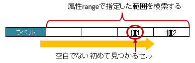
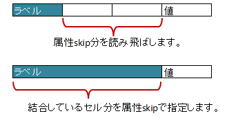

.. _annotationXlsLabelledCell:

^^^^^^^^^^^^^^^^^^^^^^^^^^^^^^^^
``@XlsLabelledCell``
^^^^^^^^^^^^^^^^^^^^^^^^^^^^^^^^

セルの見出し用のラベルセルを指定し、その左右もしくは下側のセルの値をマッピングします。

フィールドまたはメソッドに対して付与します。
 
* 属性 ``label`` で、見出しとなるセルの値を指定します。
* 属性 ``type`` で、見出しセルから見て値が設定されている位置を指定します。
    
  * 列挙型 ``LabelledCellType`` で、左右もしくは下側のセルを指定できます。
    
* 属性 ``optional`` で、見出しとなるセルが見つからない場合に無視するかどうかを指定しできます。

.. figure:: ./_static/LabelledCell.png
   :align: center
   
   LabelledCell

.. sourcecode:: java
    
    @XlsSheet(name="Users")
    public class SampleSheet {
    
        @XlsLabelledCell(label="ラベル1", type=LabelledCellType.Right)
        private String title;
        
        // ラベルセルが見つからなくても処理を続行する
        @XlsLabelledCell(label="ラベル2", type=LabelledCellType.Bottom, optional=true)
        private String summary;
    }

~~~~~~~~~~~~~~~~~~~~~~~~~~~~~~~~~~~~~~~~~~~~~~~~~~~~
ラベルセルから離れたセルを指定する方法（属性range）
~~~~~~~~~~~~~~~~~~~~~~~~~~~~~~~~~~~~~~~~~~~~~~~~~~~~

属性 ``range`` を指定すると、属性typeの方向に向かって指定した **セル数分を検索** し、最初に発見した空白以外のセルの値を取得します。

   
   LabelledCell(range)

.. sourcecode:: java
    
    @XlsSheet(name="Users")
    public class SampleSheet {
        
        @XlsLabelledCell(label="ラベル", type=LabelledCellType.Right, range=3)
        private String title;
        
    }

~~~~~~~~~~~~~~~~~~~~~~~~~~~~~~~~~~~~~~~~~~~~~~~~~~~~
ラベルセルから離れたセルを指定する方法（属性skip）
~~~~~~~~~~~~~~~~~~~~~~~~~~~~~~~~~~~~~~~~~~~~~~~~~~~~

属性 ``skip`` を指定すると、属性typeの方向に向かって指定した **セル数分離れた** セルの値をマッピングすることができます。

ラベルセルを結合してる場合、結合しているセル数-1分を指定することでマッピングできます。

   
   LabelledCell(skip)

.. sourcecode:: java
    
    @XlsSheet(name="Users")
    public class SampleSheet {
    
        @XlsLabelledCell(label="ラベル", type=LabelledCellType.Right, skip=2)
        private String title;
        
    }

~~~~~~~~~~~~~~~~~~~~~~~~~~~~~~~~~~~~~~~~~~~~~~~~~~~~
ラベルセルが重複するセルを指定する方法
~~~~~~~~~~~~~~~~~~~~~~~~~~~~~~~~~~~~~~~~~~~~~~~~~~~~

同じラベルのセルが複数ある場合は、領域の見出しを属性 ``headerLabel`` で指定します。
属性headerLabelで指定されたセルからlabel属性で指定されたセルを下方向に検索し、最初に見つかったセルをラベルセルとして使用します。

.. figure:: ./_static/LabelledCell_headerLabel.png
   :align: center
   
   LabelledCell(headerLabel)

.. sourcecode:: java
    
    @XlsSheet(name="Users")
    public class SampleSheet {
        
        @XlsLabelledCell(label="クラス名", type=LabelledCellType.Right,
                headerLabel="アクション")
        private String actionClassName;
        
        @XlsLabelledCell(label="クラス名", type=LabelledCellType.Right,
                headerLabel="アクションフォーム")
        private String formClassName;
        
    }

~~~~~~~~~~~~~~~~~~~~~~~~~~~~~~~~~~~~~~~~~~~~~~~~~~~~
ラベルセルを正規表現、正規化して指定する場合
~~~~~~~~~~~~~~~~~~~~~~~~~~~~~~~~~~~~~~~~~~~~~~~~~~~~

シートの構造は同じだが、ラベルのセルが微妙に異なる場合、ラベルセルを正規表現による指定が可能です。
また、空白や改行を除去してラベルセルを比較するように設定することも可能です。 `[ver1.1+]`

* 正規表現で指定する場合、アノテーションの属性の値を ``/正規表現/`` のように、スラッシュで囲み指定します。
  
  * スラッシュで囲まない場合、通常の文字列として処理されます。
  
  * 正規表現の指定機能を有効にするには、:doc:`システム設定のプロパティ <otheruse_config>` ``regexLabelText`` の値を trueに設定します。
  
* ラベセルの値に改行が空白が入っている場合、それらを除去し、正規化してアノテーションの属性値と比較することが可能です。
  
  * 正規化とは、空白、改行、タブを除去することを指します。
   
  * ラベルを正規化する機能を有効にするには、:doc:`システム設定のプロパティ <otheruse_config>` ``normalizeLabelText`` の値を trueに設定します。
  

これらの指定が可能な属性は、``label`` , ``headerLabel`` です。

.. sourcecode:: java
    
    // システム設定
    XlsMapper xlsMapper = new XlsMapper();
    xlsMapper.getConfig()
            .setRegexLabelText(true)        // ラベルを正規表現で指定可能にする機能を有効にする。
            .setNormalizeLabelText(true);   // ラベルを正規化して比較する機能を有効にする。
    
    // シート用クラス
    @XlsSheet(name="Users")
    public class SampleSheet {
        
        // 正規表現による指定
        @XlsLabelledCell(label="/名前.+/", type=LabelledCellType.Right)
        private String className;
        
    }

