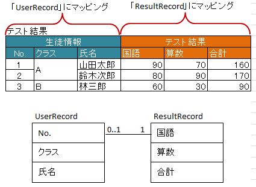

.. _annotationXlsNestedRecords:

------------------------------------------
``@XlsNestedRecords``
------------------------------------------

アノテーション :ref:`@XlsHorizontalRecords <annotationXlsHorizontalRecords>` もしくは :ref:`@XlsVerticalRecords <annotationXlsVerticalRecords>` のレコード用クラスにおいて、ツリー構造のように入れ子になっている表をマッピングする際に使用します。 `[ver.1.4+]`

^^^^^^^^^^^^^^^^^^^^^^^^^^^^^^^^^^^^^^^^^^^^^^^^^^^^^^^^^^^^^^
一対多の関係
^^^^^^^^^^^^^^^^^^^^^^^^^^^^^^^^^^^^^^^^^^^^^^^^^^^^^^^^^^^^^^

一対多の関係を表現する際には、Collection(List/Set)または、配列で指定します。

* 親子関係は、結合しているかで表現します。

  * 結合している個数が不一致の場合は、例外 ``NestedRecordMergedSizeException`` がスローされます。

* 親に指定しているJavaBeanクラスは、子や孫には指定することができません。

  * カラムの定義はレコードに記述されているため、親子に同じレコードのクラス定義があると、無限に再帰処理してしまうため、それを防ぐための制約になります。

* 属性 ``@XlsHorizotanlRecords#terminalLabel`` の終端の判定は、入れ子になったレコードごとに判定されます。

* 読み込みの際、アノテーション :ref:`@XlsIgnorable <annotationXlsIgnorable>` で、空のレコードを読み飛ばした結果、レコード数が0件となった場合は、要素数0個リストや配列が設定されます。

.. figure:: ./_static/NestedRecords_oneToMany.png
   :align: center
   
   NestedRecords(一対多の関係)

.. sourcecode:: java
    :linenos:
    
    // シート用クラス
    @XlsSheet(name="機能")
    public class SampleSheet {
        
        @XlsHorizontalRecords(tableLabel="機能一覧")
        private List<CategoryRecord> categories;
        
    }
    
    // レコード用クラス（分類）
    public class CategoryRecord {
    
        @XlsColumn(columnName="分類")
        private String name;
        
        @XlsColumn(columnName="説明（分類）")
        private String description;
        
        // ネストしたレコードのマッピング
        @XlsNestedRecords
        private List<FunctionRecord> functions;
    
    }
    
    // レコード用クラス（機能）
    public class FunctionRecord {
    
        @XlsColumn(columnName="機能名")
        private String name;
        
        @XlsColumn(columnName="説明（機能）")
        private String description;
        
        // ネストしたレコードのマッピング
        @XlsNestedRecords
        private List<DetailRecord> details;
    
    }
    
    // レコード用クラス（詳細）
    public class DetailRecord {
    
        @XlsColumn(columnName="項目")
        private String name;
        
        @XlsColumn(columnName="値")
        private String value;
        
    }
    

^^^^^^^^^^^^^^^^^^^^^^^^^^^^^^^^^^^^^^^^^^^^^^^^^^^^^^^^^^^^^^
一対一の関係
^^^^^^^^^^^^^^^^^^^^^^^^^^^^^^^^^^^^^^^^^^^^^^^^^^^^^^^^^^^^^^

一対一の関係をマッピングする際には、ネストしたクラスを直接指定します。

クラス定義などの制約は、基本的に一対多のときと同じです。

   
   NestedRecords(一対一の関係)

.. sourcecode:: java
    :linenos:
    
    // シート用クラス
    @XlsSheet(name="学期末テスト")
    public class SampleSheet {
        
        @XlsHorizontalRecords(tableLabel="テスト結果", bottom=2)
        private List<UserRecord> users;
        
    }
    
    // レコード用クラス（生徒情報）
    public class UserRecord {
    
        @XlsColumn(columnName="No.")
        private int no;
        
        @XlsColumn(columnName="クラス", merged=true)
        private String className;
        
        @XlsColumn(columnName="氏名")
        private String name;
        
        // ネストしたレコードのマッピング
        @XlsNestedRecords
        private ResultRecord result;
    
    }
    
    // レコード用クラス（テスト結果）
    public class ResultRecord {
    
        @XlsColumn(columnName="国語")
        private int kokugo;
        
        @XlsColumn(columnName="算数")
        private int sansu;
        
        @XlsColumn(columnName="合計")
        private int sum;
    
    }
    

