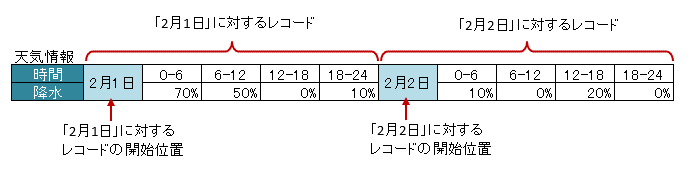

.. _annotationXlsVerticalRecords:

---------------------------------------
``@XlsVerticalRecords``
---------------------------------------

垂直方向に連続する列をListまたは配列にマッピングします。
要するに :ref:`@XlsHorizontalRecords <annotationXlsHorizontalRecords>` を垂直方向にしたものです。

メソッドに定義する場合、:ref:`@XlsHorizontalRecords <annotationXlsHorizontalRecords>` と同じくList型の引数を1つだけ取るsetterメソッドに対して付与します。

ここでは、アノテーション :ref:`@XlsHorizontalRecords <annotationXlsHorizontalRecords>` と異なる部分を説明します。
共通の使い方は、アノテーション :ref:`@XlsHorizontalRecords <annotationXlsHorizontalRecords>` の説明を参照してください。

.. figure:: ./_static/VerticalRecord.png
   :align: center
   
   VerticalRecords

.. sourcecode:: java
    :linenos:
    
    // シート用クラス
    @XlsSheet(name="Weather")
    public class SampleSheet {
        
        @XlsVerticalRecords(tableLabel="天気情報")
        private List<WeatherRecord> records;
        
    }
    
    // レコード用クラス
    public class WeatherRecord {
        
        @XlsColumn(columnName="時間")
        private String time;
        
        @XlsColumn(columnName="降水")
        private double precipitation;
    }

^^^^^^^^^^^^^^^^^^^^^^^^^^^^^^^^^^^^^^^^^^^^^^^^^^^^^^^^^^^^^^^^
表の名称位置の指定
^^^^^^^^^^^^^^^^^^^^^^^^^^^^^^^^^^^^^^^^^^^^^^^^^^^^^^^^^^^^^^^^

実際に表を作る場合、垂直方向ですが表の名称は上方に設定することが一般的です。
そのような場合、属性 ``tableLabelAbove`` の値を ``true`` に設定すると表のタイトルが上方に位置するとして処理します。 `[ver1.0+]`

.. figure:: ./_static/VerticalRecord_tableLabelAbove.png
   :align: center
   
   VerticalRecords（tableLabelAbove）

.. sourcecode:: java
    :linenos:
    
    @XlsSheet(name="Users")
    public class SampleSheet {
    
        @XlsVerticalRecords(tableLabel="天気情報", tableLabelAbove=true)
        private List<WeatherRecord> records;
    }

^^^^^^^^^^^^^^^^^^^^^^^^^^^^^^^^^^^^^^^^^^^^^^^^^^^^^^^^^^^^^^^^
表の名称から開始位置が離れた場所にある場合(right)
^^^^^^^^^^^^^^^^^^^^^^^^^^^^^^^^^^^^^^^^^^^^^^^^^^^^^^^^^^^^^^^^

表の名称が定義してあるセルの直後に表がなく離れている場合、属性 ``right`` で表の開始位置が **右方向** にどれだけ離れているか指定します。 `[ver1.0]+`

アノテーション :ref:`@XlsHorizontalRecords <annotationXlsHorizontalRecords>` の属性 ``bottom`` と同じような意味になります。

.. figure:: ./_static/VerticalRecord_right.png
   :align: center
   
   VerticalRecords（right）

.. sourcecode:: java
    :linenos:
    
    @XlsSheet(name="Users")
    public class SampleSheet {
    
        @XlsVerticalRecords(tableLabel="天気情報", right=3)
        private List<WeatherRecord> records;
    }

^^^^^^^^^^^^^^^^^^^^^^^^^^^^^^^^^^^^^^^^^^^^^^^^^^^^^^^^^^^^^^^^
表の名称から開始位置が離れた場所にある場合(bottom)
^^^^^^^^^^^^^^^^^^^^^^^^^^^^^^^^^^^^^^^^^^^^^^^^^^^^^^^^^^^^^^^^

属性 ``tableLabelAbove`` の値が ``true`` のときのみ有効になります。
表の名称がセルの直後に表がなく離れている場合、属性 ``bottom`` で表の開始位置が **下方向** にどれだけ離れているか指定します。 `[ver2.0]+`

アノテーション :ref:`@XlsHorizontalRecords <annotationXlsHorizontalRecords>` の属性 ``bottom`` と同じような意味になります。

.. figure:: ./_static/VerticalRecord_bottom.png
   :align: center
   
   VerticalRecords（bottom）

.. sourcecode:: java
    :linenos:
    
    @XlsSheet(name="Users")
    public class SampleSheet {
    
        @XlsVerticalRecords(tableLabel="天気情報", tableLabelAbove=true, bottom=3)
        private List<WeatherRecord> records;
    }

^^^^^^^^^^^^^^^^^^^^^^^^^^^^^^^^^^^^^^^^^^^^^^^^^^^^^^^^^^^^^^^^^^^^^^^^^^^^^^^^^^^^^^^^
表の見出しが横に結合されデータレコードの開始位置が離れた場所にある場合
^^^^^^^^^^^^^^^^^^^^^^^^^^^^^^^^^^^^^^^^^^^^^^^^^^^^^^^^^^^^^^^^^^^^^^^^^^^^^^^^^^^^^^^^

表の見出しセルが横に結合され、データレコードの開始位置が離れている場合、属性 ``headerRight`` でデータレコードの開始位置がどれだけ離れているか指定します。 `[ver1.1+]`

アノテーション :ref:`@XlsHorizontalRecords <annotationXlsHorizontalRecords>` の属性 ``headerBottom`` と同じような意味になります。

下記の例の場合、見出しの「テスト結果」は横に結合されているため :ref:`@XlsColumn(headerMerged=N) <annotationXlsColumnHeaderMerged>` と組み合わせて利用します。

.. figure:: ./_static/VerticalRecord_headerRight.png
   :align: center
   
   VerticalRecords(headerRight)

.. sourcecode:: java
    :linenos:
    
    // シート用クラス
    @XlsSheet(name="Weather")
    public class SampleSheet {
        
        // 見出しが横に結合され、データのレコードの開始位置が離れている場合
        @XlsVerticalRecords(tableLabel="天気情報", headerRight=2)
        private List<WeatherRecord> records;
    
    }
    
    // レコード用クラス
    public class WeatherRecord {
        
        @XlsColumn(columnName="時間")
        private String time;
        
        // セル「降水」のマッピング
        @XlsColumn(columnName="測定結果")
        private double precipitation;
        
        // セル「気温」のマッピング
        // 結合されている見出しから離れている数を指定する
        @XlsColumn(columnName="測定結果", headerMerged=1)
        private int temperature;
        
        // セル「天気」のマッピング
        // 結合されている見出しから離れている数を指定する
        @XlsColumn(columnName="測定結果", headerMerged=2)
        private String wather;
        
    }

^^^^^^^^^^^^^^^^^^^^^^^^^^^^^^^^^^^^^^^^^^^^^^^^^^^^^^^^^^^^^^^^^^^^^^^^^^^^^^^^^^^^^^^^
書き込み時にレコードが不足、余分である場合の操作の指定
^^^^^^^^^^^^^^^^^^^^^^^^^^^^^^^^^^^^^^^^^^^^^^^^^^^^^^^^^^^^^^^^^^^^^^^^^^^^^^^^^^^^^^^^

アノテーション :ref:`@XlsRecordOption <annotationXlsRecordOption>` を指定することで、書き込み時のレコードの制御を指定することができます。

* 属性 ``overOperation`` で、書き込み時にJavaオブジェクトのレコード数に対して、シートのレコード数が足りないときの操作を指定します。
 
  * ただし、 ``@XlsVerticalRecords`` の場合、列の挿入を行う ``OverOperation#Insert`` は使用できません。

* 属性 ``remainedOperation`` で、書き込み時にJavaオブジェクトのレコード数に対して、シートのレコード数が余っているときの操作を指定します。

  * ただし、 ``@XlsVerticalRecords`` の場合、列の削除を行う ``RemainedOperation#Delete`` は使用できません。

.. figure:: ./_static/VerticalRecord_RecordOption.png
   :align: center
   
   VerticalRecords(RecordOption)

.. sourcecode:: java
    :linenos:
    
    @XlsSheet(name="Users")
    public class SampleSheet {
        
        @XlsVerticalRecords(tableLabel="天気情報")
        @XlsRecordOption(overOperation=OverOperation.Copy, remainedOperation=RemainedOperation.Clear)
        private List<WeatherRecord> records;
        
    }

^^^^^^^^^^^^^^^^^^^^^^^^^^^^^^^^^^^^^^^^^^^^^^^^^^^^^^^^^^^^^^^^^^^^^^^^^^^^^^^^^^^^^^^^
任意の位置からレコードが開始するかを指定する場合
^^^^^^^^^^^^^^^^^^^^^^^^^^^^^^^^^^^^^^^^^^^^^^^^^^^^^^^^^^^^^^^^^^^^^^^^^^^^^^^^^^^^^^^^

データレコードの途中で中見出しがあり、分割されているような表の場合、アノテーション :ref:`@XlsRecordFinder <annotationXlsRecordFinder>` で、レコードの開始位置を決める処理を指定することができます。 `[ver2.0+]`

* 属性 ``value`` で、レコードの開始位置を検索する実装クラスを指定します。
* 属性 ``args`` で、レコードの開始位置を検索する実装クラスに渡す引数を指定します。

   
   VerticalRecords(RecordFinder)

.. sourcecode:: java
    :linenos:
    
    // マッピングの定義
    @XlsSheet(name="Weather")
    public class SampleSheet {
        
        @XlsOrder(1)
        @XlsVerticalRecords(tableLabel="天気情報", tableLabelAbove=true, terminal=RecordTerminal.Border, terminateLabel="/{0-9}月{0-9}[1-2]日/")
        @XlsRecordFinder(value=DateRecordFinder.class, args="2月1日")
        private List<WeatherRecord> date1;
        
        @XlsOrder(2)
        @XlsVerticalRecords(tableLabel="天気情報", tableLabelAbove=true, terminal=RecordTerminal.Border, terminateLabel="/{0-9}月{0-9}[1-2]日/")
        @XlsRecordFinder(value=DateRecordFinder.class, args="2月1日")
        private List<WeatherRecord> date2;
        
    }
    
    // 日にち用の見出しのレコードを探すクラス
    public class DateRecordFinder implements RecordFinder {
    
        @Override
        public CellPosition find(ProcessCase processCase, String[] args, Sheet sheet,
                CellPosition initAddress, Object beanObj, Configuration config) {
            
            // 実装は省略
        }
        
    }

